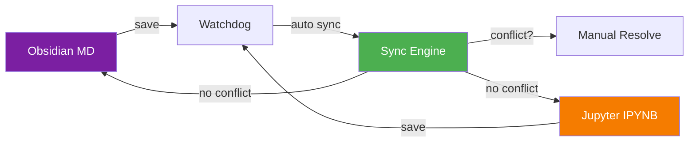

<div align="center">

# 🛠️ Newbe

**Bioinformatics Toolbox · Open Source · Ready to Use**

进化树处理 · R绘图模板 · 论文深度解读 · 组会汇报流水线 · Obsidian↔Jupyter同步 · FASTQ质控 · BAM统计 · 序列分析 · DNA损伤基因 · DESeq2格式化

[](https://github.com/Elephenman/newbe)
[](./LICENSE)
[](https://www.python.org/)
[](https://cran.r-project.org/)
[](https://github.com/Elephenman/newbe)

</div>

---

## ✨ What's Inside

<table>
<tr>
<td width="25%" align="center">

<a href="./phylo-tools/">

</a>
<br><br>
**进化树批量处理**
<br>
<sub>3 Python脚本 · FASTA→CSV→Tree</sub>
<br>
<sub>NCBI自动补全 · Newick/Nexus</sub>

</td>
<td width="25%" align="center">

<a href="./r-plot-templates/">

</a>
<br><br>
**R科研绘图模板库**
<br>
<sub>106 绑图模板 · 51 SCI图表</sub>
<br>
<sub>Seurat · clusterProfiler · DESeq2</sub>

</td>
<td width="25%" align="center">

<a href="./paper-deep-read/">

</a>
<br><br>
**论文深度解读**
<br>
<sub>复现者+审稿人双视角</sub>
<br>
<sub>Obsidian笔记 · 知识图谱 · 9参考指南</sub>

</td>
<td width="25%" align="center">

<a href="./academic-group-meeting-pipeline/">

</a>
<br><br>
**组会汇报流水线**
<br>
<sub>7 AI Skills · 论文→PPT→答辩</sub>
<br>
<sub>架构→逐字稿→防御话术</sub>

</td>
<td width="25%" align="center">

<a href="./md2ipynb-sync/">

</a>
<br><br>
**Obsidian↔Jupyter同步**
<br>
<sub>MD ↔ IPYNB 双向实时同步</sub>
<br>
<sub>GUI+CLI · watchdog · 冲突解决</sub>

</td>
<td width="25%" align="center">

<a href="./fastq-qc-checker/">

</a>
<br><br>
**FASTQ质量体检**
<br>
<sub>纯Python · Q20/Q30/GC/Adapter</sub>
<br>
<sub>无外部依赖 · 3秒出报告</sub>

</td>
<td width="25%" align="center">

<a href="./bam-stats-reporter/">

</a>
<br><br>
**BAM指标速查**
<br>
<sub>pysam封装 · mapped率/覆盖度</sub>
<br>
<sub>MAPQ/插入长度分布</sub>

</td>
<td width="25%" align="center">

<a href="./sequence-stat-visualizer/">

</a>
<br><br>
**序列统计可视化**
<br>
<sub>长度/GC/氨基酸分析</sub>
<br>
<sub>matplotlib分布图</sub>

</td>
<td width="25%" align="center">

<a href="./dna-damage-gene-collector/">

</a>
<br><br>
**DNA损伤修复基因集**
<br>
<sub>HR/NHEJ/BER/MMR/SSB/FA/p53</sub>
<br>
<sub>Venn交叉 + PubMed补充</sub>

</td>
<td width="25%" align="center">

<a href="./deseq2-result-formatter/">

</a>
<br><br>
**DESeq2结果格式化**
<br>
<sub>过滤+火山图+统计</sub>
<br>
<sub>R脚本 · Nature配色</sub>

</td>
</tr>
</table>

---

## 🧬 phylo-tools — Phylogenetic Tree Processing

One-liner pipeline for batch tip renaming after tree construction:


| Script | What it does |
|--------|-------------|
| `parse_fasta_headers.py` | Extract accession + species from NCBI FASTA headers → CSV |
| `fill_csv_from_ncbi.py` | Auto-detect missing columns → fetch from NCBI Entrez |
| `rename_tree_tips.py` | Batch rename tree tips using CSV mapping (Newick/Nexus) |

```bash
pip install biopython  # Only needed for scripts 2 & 3
python rename_tree_tips.py -t tree.nwk -c mapping.csv --column 2 -o tree_species.nwk
```

📚 [Full Documentation →](./phylo-tools/README.md)

---

## 🎨 r-plot-templates — R Plot Template Gallery

> **106 绑图模板 · 51 SCI图表代码 · Seurat单细胞 · 生信工具实战**

```
r-plot-templates/
├── 01_绘图模板代码/          ← 106 templates (file name = chart type)
├── 02_SCI图表代码/           ← 51 bioR series (bioR02 ~ bioR51)
├── 05_Seurat单细胞分析/      ← Complete Seurat handbook + chapter notes
├── 06_生信工具代码库/        ← clusterProfiler · DESeq2 · tidyverse · pandas
└── R绘图代码全集_Obsidian学习笔记.md
```

<details>
<summary><b>📊 106 Drawing Templates — Full Category List</b></summary>

| Category | Templates |
|----------|-----------|
| 📊 Bar/Stacked | 柱状图 · 堆积图 · 双向柱状图 · 环形柱状图 · 嵌套柱状图 · 柱状堆积+多因子分面 |
| 📦 Box/Violin | 箱线图 · 小提琴图 · 云雨图 · 豆荚图 · 半小提琴图 · 雨云图 |
| 🔵 Scatter | 散点+回归 · 散点+拟合+分面 · 散点密度图 · ECDF · 散点+箱线+小提琴 |
| 🔥 Heatmap | 环形热图 · 双层环形热图 · 单列热图 · 三角形热图 · 热图+柱状堆积 |
| 🌋 Volcano | 火山图 · 多组火山图 |
| 🌳 Phylo | 半圆进化树 · tree+分支颜色+注释 · tree+柱状堆积图 · 基于ggmsa多序列比对 |
| 🗺️ Map | 世界地图+采样点 · 中国地图+散点+柱状图 |
| 🕸️ Network | 网络图 · 弦图 · mantel test · 线性相关性 · 两组矩阵相关性 |
| 🎯 Others | 桑基图 · 雷达图 · 曼哈顿图 · 南丁格尔图 · 词云图 · 花瓣图 · Venn · 气泡图 · 三元相图 · 平行坐标图 · 议会图 · 时间序列 |

</details>

<details>
<summary><b>🔬 51 SCI Chart Codes — bioR Series Index</b></summary>

| Range | Category |
|-------|----------|
| bioR02-06 | Bar plots (stat / p-value / percentage / grouped) |
| bioR07-10 | Box plots (sorted / diff / clinical / facet) |
| bioR11-13 | Violin plots (single / multi / facet) |
| bioR14-16 | Pair diff · Balloon · Deviation |
| bioR17-18 | Heatmap (pheatmap / clinical) |
| bioR19-21 | Volcano · Venn · UpSetR |
| bioR22-25 | Correlation (scatter / circos / network) |
| bioR26-30 | Radar · Alluvial · Pie · Bubble · Lollipop |
| bioR31-33 | GO circos · KEGG circos · multiGSEA |
| bioR34-38 | Survival (discrete / continuous / cutoff / 2vars / forest) |
| bioR39-44 | Nomogram · ROC · multiROC · timeROC · multiTimeROC |
| bioR45-51 | PCA · 3dPCA · Circos · Genome · ggtree · maftools · gganatogram |

</details>

---

## 📖 paper-deep-read v3 — Deep Paper Reading Skill

> **Reproducer + Reviewer dual-perspective · Obsidian Vault output · Knowledge Graph**

```
paper-deep-read/
├── agents/        ← analyzer · extractor · knowledge-builder · qa-reviewer
├── references/    ← 9 guides (bioinfo specials · AI specials · critical analysis · figure interpretation · reading guide · format · quality · multi-paper · type adaptation)
├── scripts/       ← pdf_extract · formulas · tables · obsidian_note · knowledge_graph · vault_organizer
├── templates/     ← single-paper · comparison · bioinformatics · knowledge-base
├── config.json · SKILL.md · README.md
```

**Key Features:**
- 🔄 Narrative-flow embedded Figure interpretation (⚠️ original caption cross-check)
- 🔗 5-step logic closure · ★ Turning point / dual-node markers
- 🧪 Method limitation highlighted · [[4.X]] cross-section links
- 📊 Full PDF image extraction (Figure + Table + Formula)

📚 [Full Documentation →](./paper-deep-read/README.md)

---

## 🎤 academic-group-meeting-pipeline — Group Meeting Pipeline

> **Paper → Architecture → Slides → Script → Defense — 7 Skills, One Pipeline**

```
┌─────────────────────┐
│  group-meeting-pipeline  │ ← Total orchestration
├─────────────────────┤
│  paper-logic-deconstructor │ ← Extract skeleton
│  methodology-critic        │ ← Find design flaws
├─────────────────────┤
│  ppt-architect             │ ← Visual hierarchy
│  ppt-implement-custom      │ ← PPTX generation
├─────────────────────┤
│  speech-writer             │ ← Oral script
│  qa-defense-system         │ ← Predict advisor Q&A
└─────────────────────┘
```

📚 [Full Documentation →](./academic-group-meeting-pipeline/README.md)

---

## 📝 md2ipynb-sync — Obsidian ↔ Jupyter Notebook Sync

> **Write in Obsidian, Run in JupyterLab — Changes sync automatically**

Based on [Jupytext](https://jupytext.readthedocs.io/), this tool keeps your Obsidian Markdown notes and Jupyter Notebooks in perfect sync.



| Feature | Description |
|---------|-------------|
| 🔄 Bidirectional sync | MD ↔ IPYNB changes auto-sync on save |
| 👁 Real-time monitor | Watchdog detects file changes instantly |
| 🖱 GUI + CLI modes | Full GUI for daily use, CLI for automation |
| ⚠️ Conflict resolution | Visual diff when both sides changed |
| 📋 Batch pairing | Scan directory → one-click pair all MD files |
| 🔗 Jupytext compatible | Created notebooks work natively in JupyterLab |

```bash
pip install -e .            # Install
python -m md2ipynb_sync.main # Launch GUI
```

📚 [Full Documentation →](./md2ipynb-sync/README.md)

---

## 🚀 Quick Start

```bash
# Clone everything
git clone https://github.com/Elephenman/newbe.git

# Sparse checkout — only what you need
git clone --filter=blob:none --sparse https://github.com/Elephenman/newbe.git
cd newbe
git sparse-checkout set r-plot-templates
```

Each sub-directory is self-contained — just navigate and start using.

---

## 📌 Recent Updates

> **2026-04-28** — Batch 1 tools added: fastq-qc-checker · bam-stats-reporter · sequence-stat-visualizer · dna-damage-gene-collector · deseq2-result-formatter
> **2026-04-27** — Initial release: phylo-tools · r-plot-templates · paper-deep-read v3 · academic-group-meeting-pipeline · md2ipynb-sync

---

## 🗺️ Roadmap

- [x] FASTQ质量体检工具 (fastq-qc-checker)
- [x] BAM统计速查工具 (bam-stats-reporter)
- [x] 序列统计可视化 (sequence-stat-visualizer)
- [x] DNA损伤修复基因集收集器 (dna-damage-gene-collector)
- [x] DESeq2结果格式化+火山图 (deseq2-result-formatter)
- [ ] GO/KEGG富集分析流水线 (enrichment-auto-pipeline)
- [ ] PCA/tSNE/UMAP降维可视化
- [ ] Seurat质控一键流水线
- [ ] 科研绘图配色方案生成器
- [ ] 多子图组合排版工具
- [ ] 项目目录初始化器
- [ ] PubMed批量检索器
- [ ] ... 50 tools total, 45 more incoming

---

## 📄 License

[MIT License](./LICENSE) — use freely, modify freely, share freely.