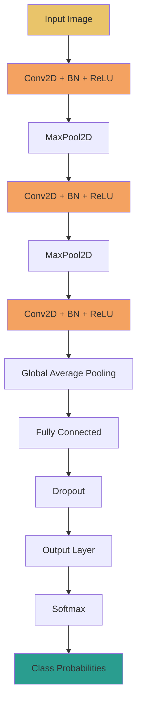
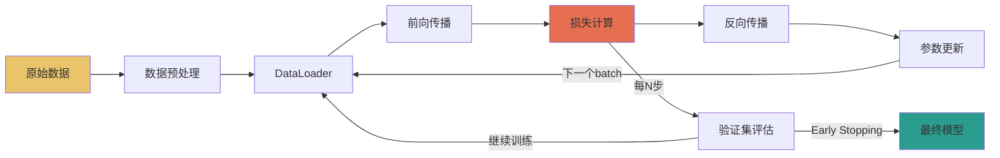

# AI/ML 专用功能参考

本文件定义论文解读技能在处理AI/ML论文时的专用功能模块。当论文领域标签包含 `ai-ml` 时自动激活。

---

## 一、模型架构可视化 (Model Architecture Visualization)

### 1.1 可视化原则

- 使用 Mermaid `graph TD`（自上而下）展示模型架构
- 输入在顶部，输出在底部
- 数据流方向用箭头表示
- 用 `style` 指令区分模块类型
- 跳跃连接用虚线箭头
- 注意力机制用特殊样式

### 1.2 Transformer 模板

```mermaid
graph TD
    Input[Input Token Sequence] --> Emb[Token Embedding + Positional Encoding]

    subgraph Transformer Block ×N
        Emb --> MHA[Multi-Head Attention]
        MHA --> Add1((+))
        Emb -.->|残差连接| Add1
        Add1 --> LN1[Layer Normalization]
        LN1 --> FFN[Feed-Forward Network]
        FFN --> Add2((+))
        LN1 -.->|残差连接| Add2
        Add2 --> LN2[Layer Normalization]
    end

    LN2 --> Linear[Linear Projection]
    Linear --> Softmax[Softmax]
    Softmax --> Output[Output Distribution]

    style Input fill:#E9C46A
    style Output fill:#2A9D8F
    style MHA fill:#F4A261
    style FFN fill:#E76F51
    style Add1 fill:#D6E4F0
    style Add2 fill:#D6E4F0
```

**关键组件说明**：
- **Multi-Head Attention**: Q/K/V矩阵分头计算注意力，拼接后线性投影
- **Add & Norm**: 残差连接(x + Sublayer(x)) + LayerNorm
- **FFN**: 两层全连接，中间ReLU激活，W₁·ReLU(W₂·x + b₂) + b₁

### 1.3 CNN 模板



### 1.4 GAN 模板

```mermaid
graph TD
    Noise[Random Noise z] --> G[Generator]
    G --> Fake[Generated Data]
    Real[Real Data] --> D[Discriminator]
    Fake --> D
    D --> Output[Real/Fake?]
    Output -->|反馈| G
    Output -->|反馈| D

    style Noise fill:#E9C46A
    style G fill:#2A9D8F
    style D fill:#E76F51
    style Output fill:#264653
```



### 1.5 Diffusion Model 模板

```mermaid
graph TD
    subgraph 前向过程(加噪)
        X0[x₀ 原始图像] --> X1[x₁]
        X1 --> X2[x₂]
        X2 --> XT[...xT 纯噪声]
    end

    subgraph 反向过程(去噪)
        XT2[xT 纯噪声] --> U1[U-Net 预测噪声]
        U1 --> XT1[xT-1]
        XT1 --> U2[U-Net 预测噪声]
        U2 --> X02[x₀ 生成图像]
    end

    style X0 fill:#2A9D8F
    style XT fill:#264653
    style X02 fill:#2A9D8F
    style U1 fill:#F4A261
    style U2 fill:#F4A261
```

### 1.6 GNN 模板

```mermaid
graph TD
    NodeFeatures[节点特征 hᵢ] --> MsgPass[消息传递]
    EdgeFeatures[边特征 eᵢⱼ] --> MsgPass
    NeighborInfo[邻居信息] --> MsgPass
    MsgPass --> Aggregate[聚合 Σ/mean/max]
    Aggregate --> Update[更新 hᵢ' = σ(W·AGG + b)]
    Update --> Readout[读出函数]
    Readout --> Output[图级/节点级输出]

    style NodeFeatures fill:#E9C46A
    style Output fill:#2A9D8F
    style MsgPass fill:#F4A261
    style Aggregate fill:#E76F51
```

### 1.7 特殊组件表示法

| 组件 | Mermaid表示 | 说明 |
|------|------------|------|
| 残差/跳跃连接 | `A -.->|残差连接| B` | 虚线箭头 |
| 注意力机制 | `style MHA fill:#F4A261` | 橙色高亮 |
| 多头注意力 | 在节点内标注"Multi-Head ×h" | h为头数 |
| Dropout | 单独节点，灰底 | `style Dropout fill:#D6E4F0` |
| 归一化 | 单独节点，浅蓝底 | `style LN fill:#D6E4F0` |
| 激活函数 | 在FFN节点内标注 | 不单独画节点 |

---

## 二、训练流程可视化

### 2.1 训练流程模板



### 2.2 损失函数表示

在架构图中，损失函数节点用红色标注，并在Callout块中详细说明：

> [!info]- 进阶：损失函数详解
> **损失函数名 (Loss Function Name)**
> - 公式：L = ...
> - 直觉含义：...
> - 与其他损失的区别：...
> - 适用场景：...

### 2.3 超参数提取表模板

| 超参数 | 值 | 含义 | 默认值 | 调参建议 |
|--------|----|------|--------|----------|
| learning_rate | 3e-4 | 初始学习率 | 1e-3 | Adam常用1e-4~3e-4 |
| batch_size | 32 | 每批样本数 | - | 受GPU内存限制 |
| epochs | 100 | 训练轮数 | - | 配合early stopping |
| weight_decay | 1e-5 | L2正则化系数 | 0 | 防过拟合 |
| warmup_steps | 1000 | 学习率预热步数 | 0 | Transformer常用 |
| dropout | 0.1 | Dropout比例 | 0 | 0.1-0.5常见 |
| hidden_dim | 768 | 隐藏层维度 | - | 768/1024/2048常见 |
| num_heads | 12 | 注意力头数 | - | hidden_dim/num_heads=64 |
| num_layers | 12 | Transformer层数 | - | 6/12/24常见 |

---

## 三、AI/ML 术语表

| 中文 | 英文 | 简要解释 |
|------|------|----------|
| 注意力机制 | Attention Mechanism | 让模型聚焦于输入中相关部分的可学习权重机制 |
| 自注意力 | Self-Attention | 序列中每个位置对其他所有位置计算注意力的方法 |
| 多头注意力 | Multi-Head Attention | 并行多组注意力计算再拼接，捕捉不同子空间信息 |
| 词嵌入 | Embedding | 将离散符号映射为连续向量表示 |
| 微调 | Fine-tuning | 在预训练模型基础上用下游任务数据继续训练 |
| 预训练 | Pre-training | 在大规模数据上训练模型的通用表示能力 |
| 批大小 | Batch Size | 一次前向/反向传播使用的样本数 |
| 学习率 | Learning Rate | 每步参数更新的步长大小 |
| 轮次 | Epoch | 完整遍历一次训练数据集 |
| 过拟合 | Overfitting | 模型在训练集表现好但泛化能力差 |
| 正则化 | Regularization | 防止过拟合的技术（L1/L2/Dropout等） |
| 丢弃 | Dropout | 训练时随机丢弃神经元防止共适应 |
| 残差连接 | Residual Connection | 将输入直接加到输出上(x + F(x))，缓解梯度消失 |
| 层归一化 | Layer Normalization | 对同一层所有特征做归一化，稳定训练 |
| 批归一化 | Batch Normalization | 对同一特征跨batch归一化，加速收敛 |
| Softmax | Softmax | 将向量转化为概率分布的函数 |
| 交叉熵 | Cross-Entropy | 衡量预测分布与真实分布差异的损失函数 |
| 梯度下降 | Gradient Descent | 沿梯度反方向更新参数的优化方法 |
| 反向传播 | Backpropagation | 利用链式法则计算损失对各参数梯度的算法 |
| 激活函数 | Activation Function | 引入非线性的函数（ReLU/Sigmoid/Tanh） |
| 卷积 | Convolution | 用滤波器提取局部特征的操作 |
| 池化 | Pooling | 降低特征图空间维度的下采样操作 |
| 感受野 | Receptive Field | 输出特征对应的输入区域大小 |
| 生成对抗网络 | GAN | 生成器和判别器对抗训练的生成模型 |
| 变分自编码器 | VAE | 学习数据潜在分布的生成模型 |
| 扩散模型 | Diffusion Model | 通过逐步去噪生成数据的模型 |
| 图神经网络 | GNN | 处理图结构数据的神经网络 |
| 序列到序列 | Seq2Seq | 将输入序列映射为输出序列的模型架构 |
| Beam Search | Beam Search | 保留top-k候选的解码搜索策略 |
| 温度参数 | Temperature | 控制Softmax输出分布平滑度的参数 |
| Top-k采样 | Top-k Sampling | 只从概率最高的k个token中采样的策略 |
| 提示工程 | Prompt Engineering | 设计输入提示以引导模型输出的技术 |
| 上下文学习 | In-Context Learning | 不更新参数，仅通过示例让模型学习新任务 |
| 思维链 | Chain-of-Thought | 让模型逐步推理得出答案的提示策略 |
| 幻觉 | Hallucination | 模型生成看似合理但实际不正确的内容 |
| 对齐 | Alignment | 使模型行为符合人类价值观和意图 |
| 指令微调 | Instruction Tuning | 用指令-回答对微调模型使其遵循指令 |
| 奖励模型 | Reward Model | 学习人类偏好的打分模型 |
| 强化学习 | Reinforcement Learning | 通过与环境交互获得奖励来学习策略 |
| 标注 | Labeling | 为数据添加标签/注释的过程 |

---

## 四、Benchmark 对比表模板

### 4.1 对比表结构

| 方法 | 数据集 | 指标1(Acc%) | 指标2(F1) | 指标3(AUC) | 年份 | 代码 |
|------|--------|-------------|-----------|------------|------|------|
| **本文方法** | **Dataset** | **XX.X** | **XX.X** | **XX.X** | **2024** | [Link] |
| Baseline-A | Dataset | XX.X | XX.X | XX.X | 2023 | - |
| Baseline-B | Dataset | XX.X | XX.X | XX.X | 2023 | - |

注：**加粗**为本文方法，最优结果用加粗标注。

### 4.2 提取规则

1. 从论文Table/结果部分提取所有对比方法的数值
2. 优先提取论文主表（通常在Results章节）
3. 包含论文声称的SOTA对比
4. 如果有多个数据集，按数据集分表
5. 标注结果来源：Table N / Figure N / 正文

### 4.3 性能提升解读模板

> [!tip]- 实践要点：性能提升分析
> - **绝对提升**: 本文方法比最强基线高 X 个百分点
> - **相对提升**: (本文 - 基线) / 基线 × 100% = Y%
> - **提升是否显著**: 是否报告了p值或置信区间？
> - **代价评估**: 提升是否需要额外计算/数据/参数？
> - **消融实验**: 哪个组件贡献了最多提升？

### 4.4 消融实验表格模板

| 配置 | 组件A | 组件B | 组件C | 指标(%) | Δ |
|------|-------|-------|-------|---------|---|
| Full Model | ✓ | ✓ | ✓ | **XX.X** | - |
| w/o A | ✗ | ✓ | ✓ | XX.X | -X.X |
| w/o B | ✓ | ✗ | ✓ | XX.X | -X.X |
| w/o C | ✓ | ✓ | ✗ | XX.X | -X.X |
| Base | ✗ | ✗ | ✗ | XX.X | -X.X |

Δ = 相对完整模型的下降，用于判断每个组件的贡献。
