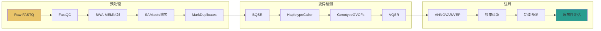
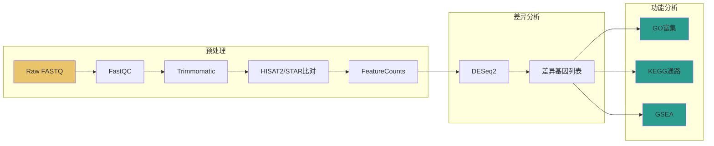

# 生物信息学专用功能参考

本文件定义论文解读技能在处理生物信息学论文时的专用功能模块。当论文领域标签包含 `bioinformatics` 时自动激活。

---

## 一、命令重现 (Command Reproduction)

### 1.1 提取原则

从论文方法部分提取所有命令行调用，构建可复现的完整命令。要求：
- **版本标注**：每个工具必须标注版本号（来自论文引用或 `--version` 输出）
- **参数完整**：所有参数及值必须明确列出，包括默认值未修改的参数
- **输入输出**：每个命令的输入文件和预期输出必须注明
- **注释充分**：每个非显而易见的参数都有中文注释

### 1.2 常用工具提取模板

#### 比对工具 (Alignment)

```bash
# BWA-MEM {{版本}} - {{描述}}
bwa mem -t {{线程数}} -M {{参考基因组.fa}} {{R1.fq}} {{R2.fq}} > {{output.sam}}
# -t: 线程数（默认：1）
# -M: 标记较短的分段为次级比对（Picard兼容）

# STAR {{版本}} - {{描述}}
STAR --runThreadN {{线程数}} \
     --genomeDir {{基因组索引目录}} \
     --readFilesIn {{R1.fq}} {{R2.fq}} \
     --readFilesCommand zcat \
     --outFileNamePrefix {{输出前缀}} \
     --outSAMtype BAM SortedByCoordinate \
     --quantMode GeneCounts
# --runThreadN: 线程数
# --outSAMtype: 输出格式（SortedByCoordinate=按坐标排序BAM）
# --quantMode GeneCounts: 同时输出基因计数

# HISAT2 {{版本}} - {{描述}}
hisat2 -p {{线程数}} -x {{基因组索引}} -1 {{R1.fq}} -2 {{R2.fq}} -S {{output.sam}}

# Bowtie2 {{版本}} - {{描述}}
bowtie2 -p {{线程数}} -x {{基因组索引}} -1 {{R1.fq}} -2 {{R2.fq}} -S {{output.sam}}
```

#### 变异检测 (Variant Calling)

```bash
# GATK {{版本}} - {{描述}}
gatk HaplotypeCaller \
     -R {{参考基因组.fa}} \
     -I {{input.bam}} \
     -O {{output.vcf}} \
     -ERC GVCF
# -ERC GVCF: 输出gVCF格式（用于联合基因分型）

# samtools {{版本}} - {{描述}}
samtools sort -@ {{线程数}} -o {{output.bam}} {{input.bam}}
samtools index {{input.bam}}
samtools mpileup -uf {{参考基因组.fa}} {{input.bam}} | bcftools call -mv -o {{output.vcf}}
```

#### 单细胞分析 (Single-Cell)

```bash
# CellRanger {{版本}} - {{描述}}
cellranger count --id={{样本ID}} \
                 --transcriptome={{参考转录组}} \
                 --fastqs={{FASTQ目录}} \
                 --sample={{样本名}} \
                 --localcores={{线程数}} \
                 --localmem={{内存GB}}

# Seurat (R) {{版本}}
# 详见代码复现Callout块中的R脚本模板

# Scanpy (Python) {{版本}}
# 详见代码复现Callout块中的Python脚本模板
```

#### 差异表达 (Differential Expression)

```bash
# DESeq2 (R) - 差异表达分析
# 详见统计方法解读中的DESeq2模板
```

### 1.3 参数表模板

每个提取的命令必须附带参数解读表：

| 参数 | 值 | 含义 | 默认值 | 调参建议 |
|------|----|------|--------|----------|
| -t | 8 | 线程数 | 1 | 根据CPU核数设置 |
| -M | — | 标记次级比对 | 关闭 | Picard下游分析时必须开启 |

### 1.4 流程重建策略

当论文方法描述碎片化时（如"reads were aligned using BWA, followed by GATK best practices"）：
1. 识别工具链（BWA → GATK）
2. 填充标准流程中的隐含步骤（排序、标记重复、BQSR等）
3. 用 `[推断步骤]` 标注未明确描述的操作
4. 在Callout块中说明推断依据

---

## 二、分析流水线可视化 (Analysis Pipeline Visualization)

### 2.1 可视化原则

- 使用 Mermaid `graph LR`（从左到右）展示分析流程
- 每个节点代表一个处理步骤
- 边代表数据流
- 用 `style` 指令区分步骤类型
- 超过10个步骤时使用 `subgraph` 分组

### 2.2 scRNA-seq 流水线模板


### 2.3 WGS/WES 流水线模板



### 2.4 RNA-seq 流水线模板



### 2.5 ChIP-seq 流水线模板


### 2.6 通用流水线模板


---

## 三、数据库资源汇总 (Database Resource Summary)

### 3.1 常见数据库ID格式

| 数据库 | ID格式 | 示例 | 数据类型 | 访问URL模式 |
|--------|--------|------|----------|-------------|
| GEO | GSE/GSM/GSX | GSE123456 | 表达谱 | `ncbi.nlm.nih.gov/geo/query/acc.cgi?acc={ID}` |
| SRA | SRR/SRX/SRP | SRR1234567 | 测序原始数据 | `ncbi.nlm.nih.gov/sra/{ID}` |
| PDB | 4字符 | 7ABC | 蛋白质3D结构 | `rcsb.org/structure/{ID}` |
| UniProt | 6字符 | P12345 | 蛋白质序列/功能 | `uniprot.org/uniprot/{ID}` |
| ENSEMBL | ENS+前缀+数字 | ENSG00000141510 | 基因/转录本 | `ensembl.org/id/{ID}` |
| RefSeq | NM_/NP_/XP_ | NM_001126112 | 参考序列 | `ncbi.nlm.nih.gov/nuccore/{ID}` |
| GenBank | 字母+数字 | CP012345 | 核酸序列 | `ncbi.nlm.nih.gov/nuccore/{ID}` |
| ClinVar | VCV/RCV | VCV000123 | 临床变异 | `ncbi.nlm.nih.gov/clinvar/variation/{ID}` |
| dbSNP | rs+数字 | rs123456 | SNP | `ncbi.nlm.nih.gov/snp/{ID}` |
| KEGG | 通路ID | hsa04110 | 代谢通路 | `genome.jp/kegg-bin/show_pathway?{ID}` |
| GTEx | - | - | 组织表达 | `gtexportal.org` |
| TCGA | - | - | 癌症基因组 | `portal.gdc.cancer.gov` |

### 3.2 数据库汇总表模板

解读每篇论文时必须提取并整理：

| 数据库 | ID | 数据类型 | 用途 | 访问方式 | 备注 |
|--------|-----|----------|------|----------|------|
| GEO | GSEXXXXX | RNA-seq | 差异表达分析原始数据 | 公开下载 | 包含N个样本 |
| SRA | SRRXXXXXX | 原始测序 | FASTQ文件 | SRA Toolkit下载 | 双端测序 |
| PDB | 7ABC | 蛋白质结构 | 分子对接 | 公开下载 | X射线衍射，2.1Å |

### 3.3 按类别分组

- **序列数据库**: GEO, SRA, GenBank, RefSeq, ENSEMBL
- **蛋白质数据库**: UniProt, PDB, AlphaFold DB
- **基因组数据库**: UCSC Genome Browser, ENSEMBL, NCBI Assembly
- **通路数据库**: KEGG, Reactome, WikiPathways, BioCyc
- **变异数据库**: ClinVar, dbSNP, gnomAD, COSMIC, 1000 Genomes
- **表达数据库**: GTEx, TCGA, Human Protein Atlas, Single Cell Portal
- **功能注释**: GO, InterPro, Pfam, SMART

---

## 四、统计方法解读 (Statistical Method Interpretation)

### 4.1 解读模板

每个统计方法按以下结构解读：

> **方法名 (English Name)**
> - **原理**：一句话中文解释核心原理
> - **适用场景**：什么情况下用这个方法
> - **结果怎么看**：关键数值和阈值的含义
> - **常见误区**：初学者容易犯的错
> - **进阶参考**：深入学习资源

### 4.2 DESeq2

- **原理**：基于负二项分布(Negative Binomial Distribution)建模RNA-seq计数数据，通过广义线性模型(GLM)估计基因表达的离散度，再进行 Wald 检验计算差异显著性
- **适用场景**：RNA-seq差异表达基因鉴定；至少3个生物学重复；计数数据（非RPKM/TPM）
- **结果怎么看**：
  - `log2FoldChange`: 表达量变化的倍数（正值=上调，负值=下调）
  - `pvalue`: 原始p值（未校正）
  - `padj`: BH校正后的p值（通常用 padj < 0.05 作为阈值）
  - 常用筛选: |log2FC| > 1 且 padj < 0.05
- **常见误区**：
  - 误将RPKM/TPM值输入DESeq2（应使用原始计数）
  - 忽略离散度估计（样本少时离散度估计不稳定）
  - 不做独立过滤（independent filtering可提高检验力）
- **进阶参考**：Love et al., 2014, Genome Biology

### 4.3 Wilcoxon 秩和检验

- **原理**：非参数检验，比较两组样本的秩和(rank sum)差异。不假设数据服从正态分布
- **适用场景**：非正态分布数据；小样本(n<30)；有序数据；单细胞数据的标记基因鉴定
- **结果怎么看**：
  - `W/U统计量`: 秩和值
  - `p-value`: 两组差异显著性
  - 效应量: rank-biserial correlation (r = 1 - 2U/(n1×n2))
- **常见误区**：
  - 与Mann-Whitney U检验混淆（两者等价）
  - 大样本时误用（n>50可考虑t检验）
  - 忽略效应量（仅看p值不看效应大小）

### 4.4 Benjamini-Hochberg (BH) 校正

- **原理**：控制错误发现率(FDR, False Discovery Rate)，即在所有阳性结果中预期假阳性的比例。将p值排序后，第i个p值的校正值为 p×n/i
- **适用场景**：多重检验校正；差异表达/富集分析中同时检验成千上万个假设
- **与Bonferroni区别**：
  - Bonferroni: 控制家族错误率(FWER)，p×n，更严格但更保守
  - BH: 控制FDR，p×n/i，允许更多阳性结果，适用于探索性分析
- **结果怎么看**：`padj/q-value < 0.05` 表示FDR控制在5%以内
- **常见误区**：误以为padj < 0.05意味着95%的发现都是真阳性（实际含义是预期假阳性比例≤5%）

### 4.5 t-SNE / UMAP

- **原理**：非线性降维可视化方法。t-SNE将高维数据的局部邻域关系保留到2D/3D空间；UMAP在保留局部结构的同时也更好保留全局结构
- **适用场景**：高维数据可视化（单细胞、流式细胞术等）；聚类结果展示；不用于定量分析
- **参数选择**：
  - t-SNE `perplexity`: 通常5-50，默认30；数据量大时增大
  - UMAP `n_neighbors`: 通常5-50，默认15；控制局部/全局结构平衡
  - UMAP `min_dist`: 通常0.001-0.5，默认0.1；控制点聚集程度
- **结果解读注意**：
  - **点之间的距离不反映真实距离**（仅邻域关系有意义）
  - **聚类大小不代表真实大小**（t-SNE会压缩密集区域）
  - 不同参数可能产生不同形状（需用多种参数验证）
- **常见误区**：试图从t-SNE/UMAP图上定量比较簇间距离

### 4.6 轨迹推断 / 伪时间分析 (Pseudotime)

- **原理**：基于单细胞转录组数据推断细胞的分化轨迹，将每个细胞映射到连续的伪时间轴上，反映分化进程
- **适用场景**：细胞分化研究；发育生物学；癌症演进分析
- **常见工具**：
  - Monocle3: 基于反向图嵌入(Reversed Graph Embedding)，适合复杂分支
  - Slingshot: 基于MST(Minimum Spanning Tree)，适合已知起始/终止状态
  - PAGA: 基于图抽象，适合大规模数据
- **结果解读**：伪时间值仅表示相对顺序，不表示绝对时间；分支点表示分化决策
- **常见误区**：将伪时间等同于真实时间；忽略轨迹算法的假设（连续分化）

### 4.7 GSEA (Gene Set Enrichment Analysis)

- **原理**：不设阈值，将所有基因按表达变化排序，检验预定义基因集是否在排序列表的一端富集。计算富集分数(ES)和标准化富集分数(NES)
- **适用场景**：功能富集分析；差异基因数量少时（ORA方法可能无结果）
- **与ORA(Over-Representation Analysis)区别**：
  - ORA: 需要先设定差异基因阈值，仅使用显著差异基因，依赖阈值选择
  - GSEA: 不设阈值，使用所有基因的排序信息，更灵敏
- **结果解读**：
  - NES > 0: 基因集在排序列表前端富集（上调方向）
  - NES < 0: 基因集在排序列表后端富集（下调方向）
  - |NES| > 1 且 FDR q-value < 0.25: 通常认为显著
- **常见误区**：用padj < 0.05作阈值（GSEA通常用FDR < 0.25）；忽略NES方向

---

## 五、生信术语表

| 中文 | 英文 | 简要解释 |
|------|------|----------|
| 比对 | Alignment/Mapping | 将测序reads定位到参考基因组上的过程 |
| 变异检测 | Variant Calling | 从测序数据中识别SNP、InDel等遗传变异 |
| 差异表达 | Differential Expression | 比较不同条件下的基因表达水平差异 |
| 归一化 | Normalization | 消除技术偏差使样本间可比的数据处理 |
| 降维 | Dimensionality Reduction | 将高维数据映射到低维空间保留关键信息 |
| 聚类 | Clustering | 将相似对象自动分组无监督学习方法 |
| 注释 | Annotation | 为基因/变异/细胞分配功能或类型标签 |
| 富集分析 | Enrichment Analysis | 检验某基因集在功能类别中是否过度出现 |
| 特征选择 | Feature Selection | 从高维数据中选择最有信息量的特征 |
| 批次效应 | Batch Effect | 不同实验批次导致的系统性技术偏差 |
| 伪时间 | Pseudotime | 从单细胞数据推断的相对分化时间 |
| 基因计数 | Gene Count | 每个基因对应的reads数量 |
| 转录本 | Transcript | 基因经可变剪接产生的mRNA变体 |
| 启动子 | Promoter | 基因转录起始位点上游的调控区域 |
| 峰 | Peak | ChIP-seq中蛋白结合信号的富集区域 |
| 基序 | Motif | 蛋白质或DNA中保守的短序列模式 |
| 单倍型 | Haplotype | 同一染色体上紧密连锁的变异组合 |
| 连锁不平衡 | Linkage Disequilibrium | 位点间非随机关联的程度 |
| 全基因组关联 | GWAS | 在全基因组范围寻找与表型关联的变异 |
| 同义突变 | Synonymous Mutation | 不改变氨基酸编码的DNA变异 |
| 错义突变 | Missense Mutation | 改变氨基酸编码的DNA变异 |
| 移码突变 | Frameshift Mutation | 插入/缺失导致阅读框改变的变异 |
| 拷贝数变异 | CNV | 基因组区域拷贝数的增减 |
| 结构变异 | Structural Variant | 大范围基因组重排(>50bp) |
| 双端测序 | Paired-end Sequencing | 从DNA片段两端分别测序的策略 |
| 覆盖度 | Coverage/Depth | 每个碱基被测序reads覆盖的平均次数 |
| 质量控制 | QC | 评估和过滤低质量数据的过程 |
| 参考基因组 | Reference Genome | 作为比对基准的物种标准基因组序列 |
| 基因组索引 | Genome Index | 为快速比对预构建的基因组数据结构 |
| 读段 | Read | 测序仪输出的单条序列 |
| 插入片段 | Insert Size | 测序文库中DNA片段的长度 |
| 表达矩阵 | Expression Matrix | 基因×样本的计数/表达值表格 |
| 高变基因 | Highly Variable Gene | 表达量跨样本变异大的基因 |
| 标记基因 | Marker Gene | 特定细胞类型高表达的标志性基因 |
| 基因本体 | Gene Ontology (GO) | 描述基因功能的标准术语体系 |
| 通路分析 | Pathway Analysis | 分析基因在代谢/信号通路中的角色 |
| 多重检验校正 | Multiple Testing Correction | 控制多次统计检验导致的假阳性膨胀 |
| 效应量 | Effect Size | 衡量组间差异大小的统计量 |
| 主成分分析 | PCA | 线性降维方法保留最大方差方向 |
| 空间转录组 | Spatial Transcriptomics | 同时获取基因表达和空间位置信息的技术 |
| ATAC-seq | Assay for Transposase-Accessible Chromatin | 检测开放染色质区域的技术 |
| Hi-C | High-throughput Chromosome Conformation Capture | 检测三维基因组互作的技术 |
