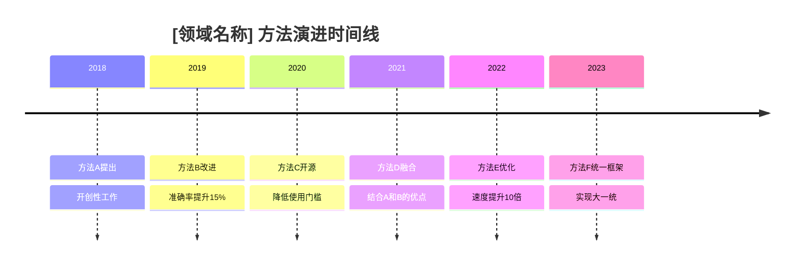

# 多论文操作规范 (Multi-Paper Operations Specification)

> 本文档定义了论文深度解读技能中处理多篇论文时的操作规范，包括批量分析模式、横向对比模式、知识图谱构建、自动追踪机制，以及PaperVault管理系统。

---

## 1. 批量分析模式 (Batch Analysis Mode)

### 1.1 输入规范

批量分析模式接受以下输入格式：

```yaml
# batch_config.yaml
input:
  pdf_list:
    - path: "/path/to/paper1.pdf"
      priority: high
      type_hint: discovery  # 可选：提供类型提示
    - path: "/path/to/paper2.pdf"
      priority: normal
    - path: "/path/to/paper3.pdf"
      priority: low

global_parameters:
  language: zh-CN
  detail_level: comprehensive
  include_raw_notes: false
  output_format: markdown

processing:
  parallel_limit: 3  # 最多同时处理3个PDF
  timeout_per_paper: 600  # 单篇超时600秒
  checkpoint_interval: 5  # 每5篇输出进度报告
```

### 1.2 并行提取策略

当有多个PDF需要处理时，采用以下并行策略：

```
┌─────────────────────────────────────────────────────────────┐
│                      批量提取流程                            │
├─────────────────────────────────────────────────────────────┤
│                                                             │
│  [论文队列] ──┬──[Worker 1]──→ [提取结果1] ──┐              │
│               │                              │              │
│               ├──[Worker 2]──→ [提取结果2] ──┼──→ [汇总]   │
│               │                              │              │
│               └──[Worker 3]──→ [提取结果3] ──┘              │
│                                                             │
│  注意：Worker池大小固定为3，完成后复用处理新任务             │
│                                                             │
└─────────────────────────────────────────────────────────────┘
```

#### 并行处理规则

| 规则 | 说明 |
|------|------|
| 最大并发数 | 3个PDF同时提取 |
| 内存限制 | 单PDF处理内存上限4GB |
| GPU加速 | 启用CUDA加速（如可用） |
| 失败隔离 | 单PDF失败不影响其他 |
| 断点续传 | 支持从上次中断处恢复 |

### 1.3 顺序分析策略

提取完成后，按以下顺序进行深度分析：

```
论文队列（按priority和提交时间排序）
    │
    ├── 高优先级论文 → 立即分析
    │
    ├── 正常优先级论文 → 队列等待
    │
    └── 低优先级论文 → 后台处理

每篇论文深度分析步骤：
1. 类型确认
2. 大纲生成
3. 内容撰写
4. 质量审查
5. 自我批评循环
6. 最终输出
```

### 1.4 批量摘要模板

当完成多篇论文的批量处理后，生成汇总摘要：

```markdown
# 批量分析摘要报告

## 基本信息

| 字段 | 内容 |
|------|------|
| 分析日期 | {date} |
| 论文总数 | {N} |
| 处理成功 | {M} |
| 处理失败 | {K} |
| 总耗时 | {duration} |

## 论文列表

| 序号 | 标题 | 类型 | 优先级 | 状态 | 评分 |
|------|------|------|--------|------|------|
| 1 | {title1} | {type1} | {priority1} | ✅完成 | {score1}/5 |
| 2 | {title2} | {type2} | {priority2} | ✅完成 | {score2}/5 |
| ... | ... | ... | ... | ... | ... |

## 关键信息概览表

| 论文 | 研究问题 | 核心方法 | 主要发现 | 质量评分 |
|------|---------|---------|---------|---------|
| {title1} | {Q1} | {M1} | {F1} | {S1}/5 |
| {title2} | {Q2} | {M2} | {F2} | {S2}/5 |

## 方法分布统计

- 方法学论文: N篇 (X%)
- 发现型论文: N篇 (X%)
- 综述论文: N篇 (X%)
- 计算/生信论文: N篇 (X%)
- 数据库/资源论文: N篇 (X%)
- 结构生物学论文: N篇 (X%)

## 领域分布统计

{饼图或条形图展示}

## 处理失败详情

| 论文 | 失败原因 | 错误类型 | 可重试 |
|------|---------|---------|--------|
| {title} | {reason} | {error_type} | 是/否 |
```

### 1.5 进度追踪

每完成一篇论文，输出进度更新：

```markdown
## 批量处理进度

### 进度条

[████████████████████░░░░░░░░] 12/20 (60%)

### 当前状态

| 项目 | 值 |
|------|-----|
| 已完成 | 12 |
| 处理中 | 2 |
| 等待中 | 6 |
| 失败 | 0 |

### 最近完成

- ✅ [10分钟前] paper1.pdf - 发现型 - 4.2/5
- ✅ [15分钟前] paper2.pdf - 方法学 - 4.5/5

### 预计剩余时间

约 25 分钟（基于当前处理速度）
```

---

## 2. 横向对比模式 (Horizontal Comparison Mode)

### 2.1 对比维度选择

进行论文对比前，首先选择对比维度：

| 维度 | 适用场景 | 常见指标 |
|------|---------|---------|
| **方法对比** | 同类问题不同方法 | 准确率、速度、复杂度、适用范围 |
| **结果对比** | 同一问题的不同发现 | 效应量、样本量、显著性、泛化性 |
| **工具对比** | 不同工具的优劣 | 易用性、功能完整度、性能、文档质量 |
| **数据对比** | 不同数据集的特征 | 规模、来源、质量、预处理需求 |
| **时间对比** | 同一领域的历史进展 | 性能提升幅度、方法演进脉络 |

### 2.2 方法对比矩阵

构建方法对比矩阵：

```markdown
## 方法对比矩阵

### 矩阵模板

| 特征/指标 | [方法A] | [方法B] | [方法C] | [方法D] |
|-----------|--------|--------|--------|--------|
| 提出年份 | YYYY | YYYY | YYYY | YYYY |
| 论文引用 | N次 | N次 | N次 | N次 |
| 准确率 | X% | X% | X% | X% |
| 速度 | 快/中/慢 | 快/中/慢 | 快/中/慢 | 快/中/慢 |
| 参数量 | N | N | N | N |
| 训练成本 | $ | $ | $ | $ |
| 推理成本 | $ | $ | $ | $ |
| 硬件需求 | 低/中/高 | 低/中/高 | 低/中/高 | 低/中/高 |
| 数据需求 | 低/中/高 | 低/中/高 | 低/中/高 | 低/中/高 |
| 可解释性 | 高/中/低 | 高/中/低 | 高/中/低 | 高/中/低 |
| 适用场景 | ... | ... | ... | ... |

### 示例对比矩阵

| 特征/指标 | AlphaFold2 | RoseTTAFold | AlphaFold3 |Uni-Fold |
|-----------|------------|-------------|------------|--------|
| 提出年份 | 2021 | 2021 | 2022 | 2022 |
| 准确率 (LDDT) | 92.4 | 88.4 | 95.1 | 89.8 |
| 速度 | 分钟级 | 秒级 | 分钟级 | 秒级 |
| 蛋白质类型 | 单链 | 单链+复合物 | 全分子 | 单链 |
| 开源 | 是 | 是 | 部分 | 是 |
| 推理成本 | 高 | 中 | 高 | 中 |

### Mermaid 矩阵热力图

```mermaid
heatmap
    title 方法性能对比热力图
    xAxis[方法] : [AlphaFold2, RoseTTAFold, AlphaFold3]
    yAxis[性能指标] : [准确率, 速度, 资源效率, 易用性]
    [92, 85, 95] : 准确率
    [60, 90, 65] : 速度
    [50, 80, 55] : 资源效率
    [70, 75, 60] : 易用性
```
```

### 2.3 结果对比表

构建结果对比表，含效应量：

```markdown
## 结果对比表

### 主指标对比

| 指标 | [论文A] | [论文B] | [论文C] | 效应量对比 |
|------|--------|--------|--------|-----------|
| 主要结果 | X±Y | X±Y | X±Y | [A vs B: d=0.XX] |
| 次要结果1 | X±Y | X±Y | X±Y | [B vs C: d=0.XX] |
| 次要结果2 | X±Y | X±Y | X±Y | [A vs C: d=0.XX] |

### 效应量解读标准

| 效应量 | 解读 |
|--------|------|
| d < 0.2 | 微小差异 |
| 0.2 ≤ d < 0.5 | 小差异 |
| 0.5 ≤ d < 0.8 | 中等差异 |
| d ≥ 0.8 | 大差异 |

### 样本与统计详情

| 论文 | 样本量(n) | 统计方法 | p值 | 效应量(d) | 置信区间 |
|------|----------|---------|-----|-----------|----------|
| {A} | n=XXX | ANOVA | p<0.001 | 0.85 | [0.72, 0.98] |
| {B} | n=XXX | t-test | p=0.023 | 0.42 | [0.15, 0.69] |
| {C} | n=XXX | Mann-Whitney | p<0.001 | 0.91 | [0.78, 1.04] |
```

### 2.4 时间线视图

使用Mermaid Timeline展示领域发展：



或使用按年份排序的表格：

```markdown
## 时间线视图

| 年份 | 论文 | 主要贡献 | 方法特点 | 性能提升 |
|------|------|---------|---------|---------|
| 2018 | Smith et al. | 开创方法A | 基线方法 | — |
| 2019 | Jones et al. | 提出方法B | 速度优化 | 速度+50% |
| 2020 | Chen et al. | 方法C | 准确率提升 | 准确率+10% |
| 2021 | Wang et al. | 方法D | 端到端 | 准确率+15% |
| 2022 | Lee et al. | 方法E | 轻量化 | 参数量-60% |
| 2023 | Park et al. | 方法F | Transformer架构 | SOTA |
```

### 2.5 差异分析

对关键差异点进行系统性分析：

```markdown
## 差异分析报告

### 关键差异点识别

| 差异维度 | [论文A] | [论文B] | 差异描述 | 可能原因 | 影响评估 |
|---------|--------|--------|---------|---------|---------|
| 数据集 | DatasetX | DatasetY | 不同来源 | 实验设计差异 | 难以直接比较 |
| 评估指标 | Acc@1 | mAP | 不同指标 | 领域惯例 | 需统一指标重评 |
| 模型规模 | 1M params | 10M params | 10倍差异 | 资源投入不同 | 大模型优势明显 |
| 实验设置 | 5-fold CV | 10-fold CV | 交叉验证策略 | 严谨性要求 | 10-fold更可靠 |

### 差异原因分析

#### 1. [差异点名称]

**现象描述**: {具体差异现象}

**可能原因**:
1. {原因1} - {解释}
2. {原因2} - {解释}
3. {原因3} - {解释}

**影响评估**: {对结论的影响程度}

#### 2. [差异点名称]

...

### 综合结论

{基于以上分析，得出综合结论，说明哪个方法/工具在什么场景下最优}

### 使用建议

| 场景 | 推荐方法 | 理由 |
|------|---------|------|
| 资源受限 | {方法} | {理由} |
| 追求最高准确率 | {方法} | {理由} |
| 快速原型开发 | {方法} | {理由} |
| 生产环境部署 | {方法} | {理由} |
```

---

## 3. 知识图谱构建 (Knowledge Graph Construction)

### 3.1 概念关联图

展示共享概念的论文之间的关联：

```mermaid
graph TD
    title 论文概念关联图

    P1["[论文A]<br/>概念1, 概念2"]
    P2["[论文B]<br/>概念2, 概念3"]
    P3["[论文C]<br/>概念1, 概念4"]
    P4["[论文D]<br/>概念3, 概念5"]

    P1 -->|共享: 概念2| P2
    P1 -->|共享: 概念1| P3
    P2 -->|共享: 概念3| P4
    P3 -->|共享: 概念4| P4
```

### 3.2 方法演进图

展示同一方法在不同年代的改进：

```mermaid
graph LR
    title 方法演进图: [方法名称]

    subgraph "第一代 (2018)"
        M1["方法A<br/>基准方法"]
        M1 --> |改进| M2
    end

    subgraph "第二代 (2020)"
        M2["方法B<br/>+XX优化"]
        M2 --> |改进| M3
    end

    subgraph "第三代 (2022)"
        M3["方法C<br/>+深度融合"]
        M3 --> |改进| M4
    end

    subgraph "第四代 (2024)"
        M4["方法D<br/>+Transformer"]
    end

    M1 -.-> |引用: 15次| M4
    M2 -.-> |引用: 42次| M4
    M3 -.-> |引用: 38次| M4
```

### 3.3 工具生态图

展示论文中使用的工具及其关系：

```mermaid
graph TD
    title 工具生态图

    subgraph "数据层"
        DB1[("数据库1")]
        DB2[("数据库2")]
        DB3[("数据库3")]
    end

    subgraph "工具层"
        T1["工具A"]
        T2["工具B"]
        T3["工具C"]
    end

    subgraph "分析层"
        A1["分析流程1"]
        A2["分析流程2"]
    end

    subgraph "可视化层"
        V1["可视化工具"]
    end

    DB1 --> T1
    DB2 --> T1
    DB2 --> T2
    DB3 --> T2
    T1 --> A1
    T2 --> A1
    T2 --> A2
    T3 --> A2
    A1 --> V1
    A2 --> V1

    style T1 fill:#e1f5fe
    style T2 fill:#e1f5fe
    style T3 fill:#e1f5fe
```

### 3.4 构建流程

#### 步骤1: 扫描已有笔记，提取概念/方法/工具

```python
def scan_papers_for_concepts(paper_notes: list[Note]) -> ConceptMap:
    """
    扫描论文笔记提取概念
    """
    extracted = {
        'concepts': [],      # 概念列表
        'methods': [],       # 方法列表
        'tools': [],         # 工具列表
        'databases': [],     # 数据库列表
        'metrics': [],       # 评估指标列表
    }

    for note in paper_notes:
        # 提取概念（名词短语）
        concepts = extract_noun_phrases(note.content, min_freq=2)
        extracted['concepts'].extend(concepts)

        # 提取方法（识别常见方法关键词）
        methods = extract_methods(note.content)
        extracted['methods'].extend(methods)

        # 提取工具（软件、数据库等）
        tools = extract_tools(note.content)
        extracted['tools'].extend(tools)

    return extracted
```

#### 步骤2: 计算概念共现矩阵

```python
def compute_cooccurrence_matrix(
    concepts: list[str],
    paper_notes: list[Note]
) -> pd.DataFrame:
    """
    计算概念共现矩阵
    """
    cooc_matrix = pd.DataFrame(
        0,
        index=concepts,
        columns=concepts
    )

    for note in paper_notes:
        # 找出当前笔记中出现的所有概念
        present_concepts = [c for c in concepts if c in note.content]

        # 更新共现计数
        for i, c1 in enumerate(present_concepts):
            for c2 in present_concepts[i+1:]:
                cooc_matrix.loc[c1, c2] += 1
                cooc_matrix.loc[c2, c1] += 1

    return cooc_matrix
```

#### 步骤3: 生成Mermaid图（>15节点用subgraph分组）

```python
def generate_mermaid_graph(
    cooc_matrix: pd.DataFrame,
    threshold: float = 0.3
) -> str:
    """
    生成Mermaid图代码
    当节点数>15时使用subgraph分组
    """
    # 筛选高共现概念对（权重>threshold）
    strong_links = get_strong_links(cooc_matrix, threshold)

    # 按聚类算法分组
    clusters = cluster_concepts(strong_links)

    # 生成Mermaid代码
    mermaid = "graph TD\n"
    mermaid += "    title 知识图谱\n\n"

    # 添加节点
    for concept in cooc_matrix.index:
        cluster = get_cluster(concept, clusters)
        mermaid += f'    {sanitize_id(concept)}["{concept}"]\n'

    # 添加边
    for (c1, c2), weight in strong_links.items():
        mermaid += f'    {sanitize_id(c1)} -->|{weight:.2f}| {sanitize_id(c2)}\n'

    # 如果节点过多，添加分组
    if len(cooc_matrix) > 15:
        mermaid += "\n    subgraph clusters\n"
        for cluster_id, members in clusters.items():
            mermaid += f'        subgraph "组{cluster_id}"\n'
            for m in members:
                mermaid += f'            {sanitize_id(m)}\n'
            mermaid += '        end\n'
        mermaid += '    end\n'

    return mermaid
```

#### 步骤4: 嵌入MOC笔记

在MOC（Map of Content）笔记中添加知识图谱引用：

```markdown
## 知识图谱

本笔记集合的知识图谱视图：

```mermaid
{generated_mermaid_code}
``

### 聚类概览

| 聚类 | 概念数 | 主要成员 |
|------|--------|---------|
| 聚类1 | N | 概念A, 概念B, 概念C |
| 聚类2 | N | 概念D, 概念E |
| ... | ... | ... |

### 核心节点

按重要性排序的中心概念：

1. **[概念A]** - 度中心性: X.XX - 出现在N篇论文中
2. **[概念B]** - 度中心性: X.XX - 出现在N篇论文中
3. **[概念C]** - 度中心性: X.XX - 出现在N篇论文中
```

---

## 4. 自动追踪机制 (Auto-Tracking Mechanism)

### 4.1 追踪配置

```yaml
# tracking_config.yaml
tracking:
  enabled: true

  sources:
    - name: PubMed
      search_type: keyword
      keywords:
        - "[领域关键词1]"
        - "[领域关键词2]"
      alert_email: false

    - name: Google Scholar
      search_type: author
      authors:
        - "[目标作者1]"
        - "[目标作者2]"
      alert_email: false

    - name: bioRxiv
      search_type: keyword
      keywords:
        - "[ preprint关键词]"
      alert_email: true

  journals:
    - name: Nature
      impact_factor: 64.8
      frequency: weekly
    - name: Science
      impact_factor: 56.9
      frequency: weekly
    - name: Cell
      impact_factor: 66.8
      frequency: weekly

  check_schedule:
    frequency: weekly  # 每周检查一次
    day: Monday
    time: "09:00"

  notification:
    channel: obsidian_notify
    min_impact_for_alert: 10.0  # IF>10才提醒
```

### 4.2 Cron设置

```yaml
# cron_config.yaml
cron_jobs:
  - name: paper_tracking_weekly
    schedule: "0 9 * * 1"  # 每周一09:00
    command: python -m paper_tracker run --config tracking_config.yaml
    timeout: 3600  # 1小时超时
    retry_on_failure: 3
    retry_delay: 300  # 5分钟后重试

  - name: paper_tracking_daily
    schedule: "0 10 * * *"  # 每天10:00
    command: python -m paper_tracker quick_check --config tracking_config.yaml
    timeout: 600  # 10分钟超时
    retry_on_failure: 2
```

### 4.3 新论文检测流程

```
[定时触发]
    │
    ▼
┌─────────────────────────────────────────┐
│           新论文检测流程                 │
├─────────────────────────────────────────┤
│                                         │
│  1. WebSearch各数据源                   │
│     ├── PubMed: 关键词搜索              │
│     ├── Google Scholar: 作者追踪        │
│     └── bioRxiv: preprint追踪           │
│     │                                     │
│     ▼                                     │
│  2. 收集搜索结果                          │
│     └── 提取: 标题/作者/期刊/日期/DOI     │
│     │                                     │
│     ▼                                     │
│  3. DOI/PMID去重                         │
│     └── 与已有笔记比对                   │
│     │                                     │
│     ▼                                     │
│  4. 新论文筛选                            │
│     └── 过滤条件:                        │
│         - 发表日期在追踪范围内            │
│         - 期刊在追踪列表中                │
│         - 关键词匹配度>阈值               │
│     │                                     │
│     ▼                                     │
│  5. 关键词匹配度排序                      │
│     └── 计算每篇论文的关键词匹配得分      │
│     │                                     │
│     ▼                                     │
│  6. 质量筛选（可选）                      │
│     └── 排除:                            │
│         - 非同行评审（除非配置允许）      │
│         - 预印本（可配置）                │
│         - 低影响力（IF < 阈值）           │
│     │                                     │
│     ▼                                     │
│  7. 输出新论文发现列表                    │
│                                         │
└─────────────────────────────────────────┘
```

### 4.4 增量更新

发现新论文后：

```markdown
# 新论文发现报告

## 报告信息

| 字段 | 内容 |
|------|------|
| 检测日期 | {date} |
| 检测来源 | {sources} |
| 新论文数 | {N} |

## 新论文列表

| 序号 | 标题 | 期刊 | 日期 | 匹配度 | 建议操作 |
|------|------|------|------|--------|---------|
| 1 | {title} | {journal} | {date} | {score}% | 立即阅读/稍后阅读/跳过 |
| 2 | {title} | {journal} | {date} | {score}% | 立即阅读/稍后阅读/跳过 |

## 论文详情预览

### 1. [{title}]({url})

**作者**: {authors}
**期刊**: {journal} (IF: {IF})
**日期**: {date}
**DOI**: {DOI}

**摘要预览**:
{abstrace前200字符}...

**关键词匹配**:
- ✅ "[关键词1]" - 出现在标题
- ✅ "[关键词2]" - 出现在摘要
- ❌ "[关键词3]" - 未匹配

**建议操作**: {操作建议}
**优先级**: {高/中/低}
```

### 4.5 用户通知

```markdown
## 论文追踪通知

### 每周摘要

**新增论文**: 5篇
**高优先级**: 2篇
**追踪作者新发表**: 1篇

### 高优先级论文

1. **[论文标题1]** - Nature (IF: 64.8)
   - 匹配关键词: "[关键词]"
   - 链接: [DOI链接]
   - 建议: 立即阅读

2. **[论文标题2]** - Cell (IF: 66.8)
   - 追踪作者新发表
   - 链接: [DOI链接]
   - 建议: 立即阅读

### 操作建议

- [查看全部新论文](00-Inbox/new_papers_{date}.md)
- [更新阅读计划](MOC.md)
- [启动批量分析](batch_process.md)
```

---

## 5. PaperVault管理 (PaperVault Management)

### 5.1 初始化

创建完整的PaperVault目录结构：

```bash
PaperVault/
├── 00-Inbox/                    # 新论文入口
│   ├── new_papers_YYYY-MM-DD.md
│   └── pending_review.md
├── 01-Literature/               # 已阅读论文
│   ├── by_year/
│   │   ├── 2024/
│   │   ├── 2023/
│   │   └── ...
│   ├── by_type/
│   │   ├── methodology/
│   │   ├── discovery/
│   │   ├── review/
│   │   ├── database/
│   │   ├── computational/
│   │   └── structural/
│   └── by_topic/
│       ├── topic_a/
│       └── topic_b/
├── 02-MOC/                      # Map of Content
│   ├── index.md
│   ├── research_overview.md
│   └── domain_moc.md
├── 03-Vault/                   # 元数据与配置
│   ├── config.yaml
│   ├── paper_database.json     # 论文数据库
│   ├── author_network.json     # 作者网络
│   └── citation_graph.json     # 引用图
├── 04-Templates/               # 笔记模板
│   ├── paper_template.md
│   ├── review_template.md
│   └── meeting_template.md
├── 05-Analysis/                # 分析与对比
│   ├── comparison/
│   ├── timeline/
│   └── knowledge_graph/
├── 06-Archive/                 # 归档
│   ├── superseded/             # 过时版本
│   └── references/             # 外部参考资料
└── README.md
```

### 5.2 日常维护

#### 论文分类放置

```python
def classify_and_place(paper: PaperNote) -> str:
    """
    确定论文应放置的目录
    优先级: by_topic > by_type > by_year
    """
    # 1. 检查是否有匹配的话题目录
    for topic_dir in get_topic_dirs():
        if paper.matches_topic(topic_dir):
            return f"01-Literature/by_topic/{topic_dir}/{paper.id}.md"

    # 2. 检查是否有匹配的类型目录
    type_dir = paper_type_to_dir(paper.type)
    return f"01-Literature/by_type/{type_dir}/{paper.id}.md"

    # 3. 默认按年份
    return f"01-Literature/by_year/{paper.year}/{paper.id}.md"
```

#### MOC更新

每当新增论文，自动更新相关MOC：

```markdown
## 论文索引更新

最近添加:
- [{date}] [{title}]({path}) - [{type}] - {score}/5

按类型统计:
- 方法学: {N}篇
- 发现型: {N}篇
- 综述: {N}篇
- ...
```

#### Dataview索引

```dataview
TABLE
  title AS "标题",
  type AS "类型",
  year AS "年份",
  score AS "评分"
FROM "01-Literature"
WHERE type = "methodology"
SORT year DESC
```

### 5.3 去重机制

```python
def check_duplication(new_paper: Paper) -> DuplicationResult:
    """
    检查论文是否重复
    """
    results = {
        'doi_match': False,
        'title_similarity': 0.0,
        'decision': None,
        'action': None
    }

    # 1. DOI精确匹配
    for existing in get_all_papers():
        if new_paper.doi and new_paper.doi == existing.doi:
            results['doi_match'] = True
            results['decision'] = 'DUPLICATE'
            results['action'] = 'LINK_EXISTING'
            return results

    # 2. 标题相似度计算（Levenshtein距离）
    for existing in get_all_papers():
        similarity = compute_title_similarity(
            new_paper.title,
            existing.title
        )
        if similarity > 0.85:  # 高相似度阈值
            results['title_similarity'] = similarity
            results['decision'] = 'POSSIBLE_DUPLICATE'
            results['action'] = 'REVIEW_NEEDED'
            return results

    results['decision'] = 'NEW_PAPER'
    results['action'] = 'CREATE_NEW'
    return results
```

### 5.4 关联发现

```python
def discover_connections(paper: PaperNote) -> list[Connection]:
    """
    自动发现论文间的关联
    """
    connections = []

    # 1. 共同引用检测
    citations = paper.get_citations()
    for existing in get_all_papers():
        common = citations & existing.get_citations()
        if len(common) >= 3:  # 共同引用≥3篇
            connections.append(Connection(
                type='shared_reference',
                target=existing.id,
                strength=len(common),
                description=f"共同引用{len(common)}篇文献"
            ))

    # 2. 共同作者检测
    authors = paper.get_authors()
    for existing in get_all_papers():
        common = authors & existing.get_authors()
        if len(common) >= 1:
            connections.append(Connection(
                type='coauthor',
                target=existing.id,
                strength=len(common),
                description=f"共同作者: {', '.join(common)}"
            ))

    # 3. 主题相似度检测
    similarity = compute_topic_similarity(paper, existing)
    if similarity > 0.7:
        connections.append(Connection(
            type='topic_related',
            target=existing.id,
            strength=similarity,
            description="主题高度相关"
        ))

    # 4. 自动添加wikilink
    for conn in connections:
        paper.add_wikilink(conn.target, conn.description)

    return connections
```

### 5.5 统计功能

#### 基础统计

```markdown
# PaperVault 统计报告

## 论文数量统计

| 指标 | 数量 |
|------|------|
| 论文总数 | {total} |
| 今年新增 | {this_year} |
| 本月新增 | {this_month} |

## 域分布

| 领域 | 数量 | 占比 |
|------|------|------|
| 领域A | N | XX% |
| 领域B | N | XX% |
| ... | ... | ... |

{mermaid_pie_chart}
```

#### 方法频率统计

```markdown
## 方法使用频率

| 方法名称 | 使用次数 | 论文列表 |
|---------|---------|---------|
| 方法A | 15 | [P1](../01-Literature/...), [P2](../...) |
| 方法B | 12 | [P3](../...), ... |
| 方法C | 8 | [P4](../...), ... |
```

#### 阅读趋势

```mermaid
lineChart
    title 月度阅读趋势
    xAxis [2024-01, 2024-02, 2024-03, 2024-04]
    yAxis 阅读数量
    "论文数" : [5, 8, 12, 15]
    "深度解读" : [3, 5, 8, 10]
```

#### 高质量论文推荐

```markdown
## 高质量论文推荐

基于4维评分筛选（均分≥4.0）:

| 论文 | 综合评分 | 可复现性 | 清晰度 | 完整性 | 深度 |
|------|---------|---------|--------|--------|------|
| [P1](path) | 4.5 | 4 | 5 | 4 | 5 |
| [P2](path) | 4.4 | 5 | 4 | 4 | 4 |
| [P3](path) | 4.3 | 4 | 4 | 5 | 4 |
```

### 5.6 数据导出

```yaml
# export_config.yaml
export:
  formats:
    - bibtex
    - ris
    - csv
    - json

  scope:
    - all           # 全部论文
    - by_year: [2024, 2023]
    - by_type: [discovery, methodology]
    - by_rating: 4.0  # 评分>=4.0

  destination:
    path: "/export/papers_{date}.{format}"

  options:
    include_abstract: true
    include_notes: true
    include_wikilinks: true
```

---

## 附录：批量操作命令行接口

```bash
# 批量分析
paper-skill batch --config batch_config.yaml --parallel 3

# 横向对比
paper-skill compare --papers paper1.md paper2.md paper3.md --dimensions method,result

# 知识图谱构建
paper-skill graph --scope 01-Literature --output knowledge_graph.md

# 自动追踪
paper-skill track --config tracking_config.yaml --check-now

# PaperVault初始化
paper-skill vault init --path /path/to/vault --template comprehensive

# 统计报告
paper-skill stats --vault /path/to/vault --report monthly

# 去重检查
paper-skill dedup --vault /path/to/vault --action report
```
