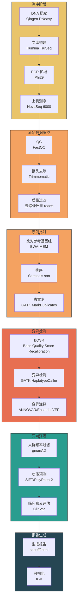
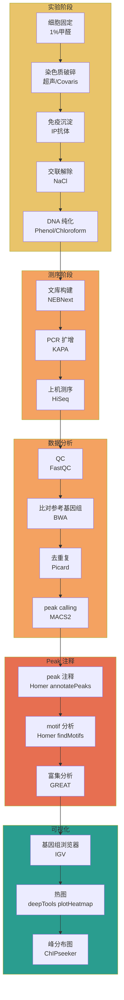
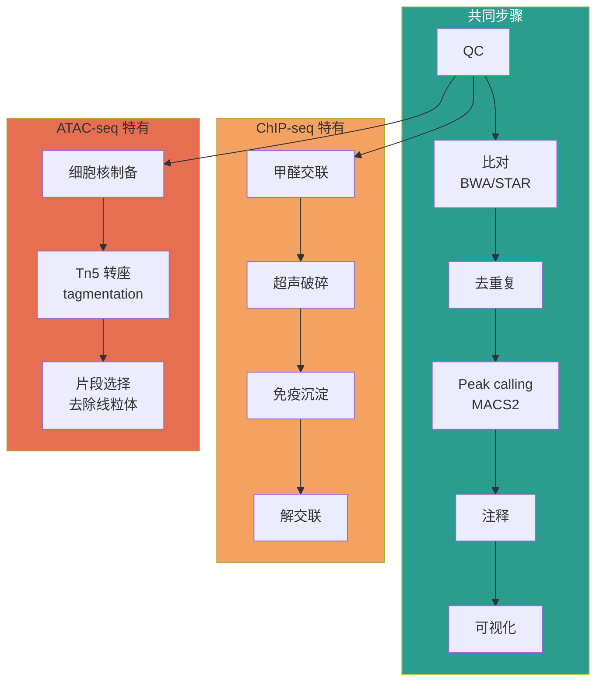
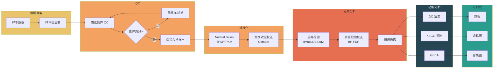
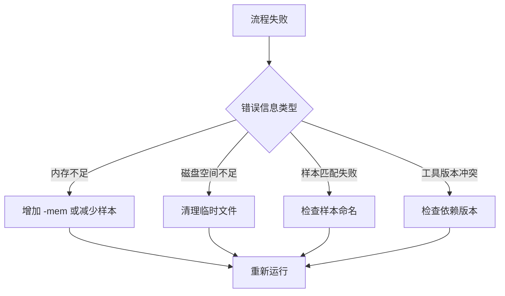

# 生信分析流水线模板

> 本文件提供常用生物信息学分析流水线的 Mermaid 可视化模板，可直接复制使用。

---

## 一、scRNA-seq 分析流水线

### 1.1 10x Genomics 标准化流程

```mermaid
graph LR
    subgraph 输入["输入数据"]
        A1[Raw Reads<br/>FASTQ]
    end

    subgraph 预处理["预处理"]
        A1 --> B1[QC<br/>FastQC]
        B1 --> C1[Trimming<br/>Cutadapt]
        C1 --> D1[质量过滤<br/>过滤低质量 reads]
    end

    subgraph 比对["序列比对"]
        D1 --> E1[Alignment<br/>Cell Ranger]
        E1 --> F1[Barcode<br/>校正]
        F1 --> G1[UMI 计数<br/>生成 Feature-Barcode 矩阵]
    end

    subgraph 质控["细胞质控"]
        G1 --> H1[双细胞去除<br/>DoubletFinder]
        H1 --> I1[低质量细胞过滤<br/>线粒体基因%、RNA含量]
        I1 --> J1[细胞周期评分<br/>Scran]
    end

    subgraph 标准化["标准化与特征选择"]
        J1 --> K1[Normalize<br/>SCTransform]
        K1 --> L1[特征选择<br/>高变异基因]
        L1 --> M1[降维<br/>PCA]
    end

    subgraph 聚类["聚类与注释"]
        M1 --> N1[邻居计算<br/>UMAP/t-SNE]
        N1 --> O1[细胞聚类<br/>Louvain/Leiden]
        O1 --> P1[细胞类型注释<br/>SingleR/Azimuth]
    end

    subgraph 注释["下游分析"]
        P1 --> Q1[标记基因鉴定<br/>FindMarkers]
        Q1 --> R1[轨迹分析<br/>Monocle/Pseudotime]
        R1 --> S1[富集分析<br/>GO/KEGG]
    end

    subgraph 输出["输出结果"]
        S1 --> T1[可视化<br/>ggplot2/UCell]
    end

    style 输入 fill:#E9C46A,stroke:#333,stroke-width:2px
    style 预处理 fill:#F4A261,stroke:#333,stroke-width:2px
    style 比对 fill:#F4A261,stroke:#333,stroke-width:2px
    style 质控 fill:#E76F51,stroke:#333,stroke-width:2px
    style 标准化 fill:#2A9D8F,stroke:#333,stroke-width:2px
    style 聚类 fill:#264653,stroke:#333,stroke-width:2px,color:#fff
    style 注释 fill:#264653,stroke:#333,stroke-width:2px,color:#fff
    style 输出 fill:#2A9D8F,stroke:#333,stroke-width:2px
```


### 1.2 Smart-seq2 流程
```mermaid
graph LR
    A[Total RNA] --> B[mRNA 富集<br/>Poly(A) selection]
    B --> C[逆转录<br/>Oligo(dT) 引物]
    C --> D[cDNA 合成<br/>SMARTScribe]
    D --> E[PCR 扩增<br/>KAPA HiFi]
    E --> F[片段化<br/>Covaris]
    F --> G[文库构建<br/>Illumina]
    G --> H[测序<br/>NovaSeq]
    H --> I[比对<br/>STAR]
    I --> J[定量<br/>Salmon]
    J --> K[标准化<br/>DESeq2]
    K --> L[下游分析<br/>差异表达/聚类]
    L --> M[可视化]

    style A fill:#E9C46A
    style M fill:#2A9D8F
```

---

## 二、WGS/WES 分析流水线

### 2.1 全基因组测序 (WGS)


### 2.2 全外显子测序 (WES)


---

## 三、RNA-seq 分析流水线

### 3.1 常规 mRNA-seq
```mermaid
graph LR
    subgraph 测序阶段["测序阶段"]
        A1[Total RNA] --> B1[mRNA 富集<br/>Poly(A) selection]
        B1 --> C1[逆转录<br/>Superscript IV]
        C1 --> D1[文库构建<br/>Illumina TruSeq]
        D1 --> E1[上机测序<br/>NovaSeq]
    end

    subgraph 预处理["数据预处理"]
        E1 --> F1[QC<br/>FastQC]
        F1 --> G1[质控过滤<br/>Trimmomatic]
        G1 --> H1[比对<br/>STAR]
    end

    subgraph 定量["表达定量"]
        H1 --> I1[计数<br/>featureCounts]
        I1 --> J1[标准化<br/>DESeq2/edgeR]
        J1 --> K1[TPM/FPKM]
    end

    subgraph 差异分析["差异表达分析"]
        K1 --> L1[差异表达<br/>DESeq2]
        L1 --> M1[p值校正<br/>BH FDR]
        M1 --> N1[阈值筛选<br/>|log2FC|>1 & padj<0.05]
    end

    subgraph 下游["下游分析"]
        N1 --> O1[GO 富集分析]
        O1 --> P1[KEGG 通路分析]
        P1 --> Q1[GSEA]
        Q1 --> R1[蛋白互作网络<br/>STRING]
    end

    style 测序阶段 fill:#E9C46A
    style 预处理 fill:#F4A261
    style 定量 fill:#F4A261
    style 差异分析 fill:#E76F51
    style 下游 fill:#2A9D8F
```

### 3.2 链特异性 RNA-seq

```mermaid
graph LR
    A[Total RNA] --> B[rRNA 去除<br/>RiboMinus]
    B --> C[片段化<br/>Mg2+ 离子]
    C --> D[逆转录<br/>dUTP 法]
    D --> E[第二链合成<br/>DNA Pol I]
    E --> F[末端修复<br/>T4 DNA Pol]
    F --> G[加 A 尾]
    G --> H[接头连接<br/>T4 DNA Ligase]
    H --> I[PCR 扩增<br/>Phusion]
    I --> J[测序<br/>Illumina]
    J --> K[QC]
    K --> L[比对<br/>STAR - strandSpecific]
    L --> M[计数<br/>featureCounts - strandSpecific]
    M --> N[标准化<br/>DESeq2]
    N --> O[差异表达]
    O --> P[可视化<br/>IGV]

    style A fill:#E9C46A
    style P fill:#2A9D8F
```


---

## 四、ChIP-seq 分析流水线

### 4.1 标准流程


### 4.2 CUT&RUN 流程


---

## 五、Chip-seq vs ATAC-seq 对比


---

## 六、通用分析流水线模板

### 6.1 模板结构
```mermaid
graph TD
    subgraph 输入["输入阶段"]
        A[原始数据<br/>{{数据类型}}]
    end

    subgraph 预处理["预处理阶段"]
        A --> B[质量控制<br/>{{质控工具}}]
        B --> C[数据过滤<br/>{{过滤标准}}]
    end

    subgraph 分析["分析阶段"]
        C --> D[主分析方法<br/>{{方法1}}]
        D --> E[辅助分析<br/>{{方法2}}]
        E --> F[验证分析<br/>{{方法3}}]
    end

    subgraph 输出["输出阶段"]
        F --> G[结果整理<br/>{{整理工具}}]
        G --> H[可视化<br/>{{可视化工具}}]
        H --> I[报告生成<br/>{{报告格式}}]
    end

    style 输入 fill:#E9C46A
    style 预处理 fill:#F4A261
    style 分析 fill:#E76F51
    style 输出 fill:#2A9D8F
```

### 6.2 自定义示例


---

## 七、流水线参数速查

### 7.1 工具版本推荐
| 分析类型 | 工具 | 推荐版本 | 备注 |
|----------|------|----------|------|
| RNA-seq比对 | STAR | 2.7.x | 支持链特异性 |
| RNA-seq比对 | HISAT2 | 2.2.x | 低内存 |
| 变异检测 | GATK | 4.3.x | Best Practice |
| Peak calling | MACS2 | 2.2.x | ChIP-seq/ATAC-seq |
| 差异表达 | DESeq2 | 1.38.x | R包 |
| 单细胞聚类 | Seurat | 4.3.x | R包 |
| 单细胞分析 | Scanpy | 1.9.x | Python |

### 7.2 常用参数配置
| 工具 | 参数 | 推荐值 | 说明 |
|------|------|--------|------|
| FastQC | --threads | 4-8 | 线程数 |
| Trimmomatic | ILLUMINACLIP | TruSeq3:2:30:10 | 接头序列 |
| STAR | --outSAMtype | BAM SortedByCoordinate | 输出格式 |
| featureCounts | -t | exon | 计数特征类型 |
| MACS2 | --qvalue | 0.05 | 显著性阈值 |

---

## 八、常见问题排查

### 8.1 流程失败检查点


### 8.2 常见问题与解决方案
| 步骤 | 问题 | 可能原因 | 解决方案 |
|------|------|----------|----------|
| QC | GC bias | 偏好性扩增 | 换用其他建库方式 |
| 比对 | 比对率低 | 测序质量/污染 | 检查原始数据 |
| 标准化 | 批次效应强 | 实验批次差异 | ComBat校正 |
| 差异分析 | 差异基因少 | 阈值设置过严 | 放宽padj阈值 |
| 富集分析 | 无显著富集 | 功能注释过时 | 更新数据库版本 |