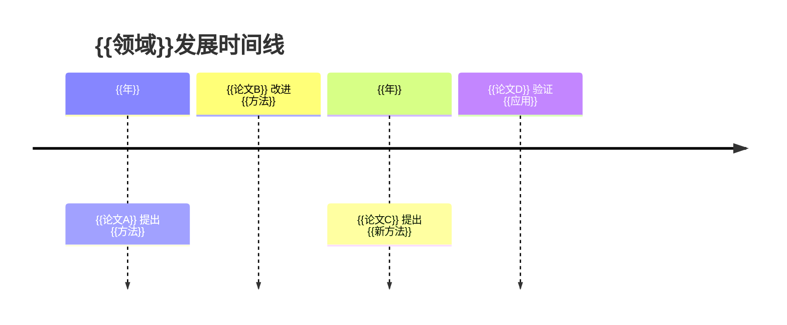
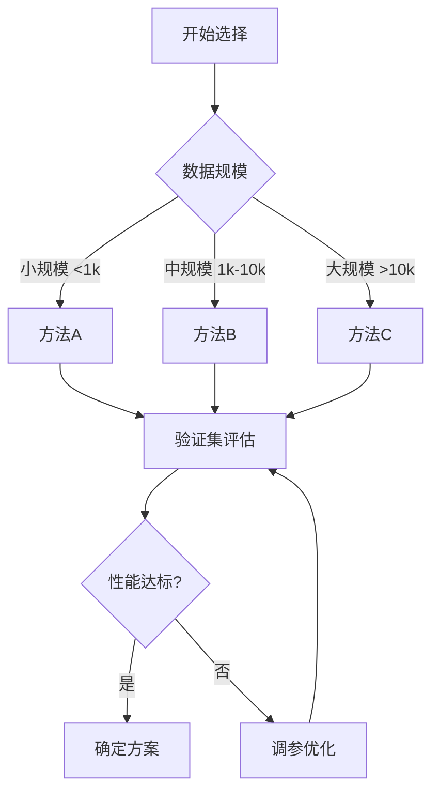

# {{对比主题}} 对比分析

> [!abstract] 一句话概括
> {{20字以内概括本对比的核心发现}}

---

## 一、对比概览表

| 维度 | {{论文A}} | {{论文B}} | {{论文C}} |
|------|-----------|-----------|-----------|
| 发表年份 | {{年}} | {{年}} | {{年}} |
| 期刊/会议 | {{期刊}} | {{期刊}} | {{期刊}} |
| 研究类型 | {{类型}} | {{类型}} | {{类型}} |
| 核心问题 | {{问题}} | {{问题}} | {{问题}} |
| 主要方法 | {{方法}} | {{方法}} | {{方法}} |
| 样本规模 | {{规模}} | {{规模}} | {{规模}} |
| 主要结论 | {{结论}} | {{结论}} | {{结论}} |

---

## 二、方法对比矩阵

### 2.1 核心方法对比
| 论文 | 核心方法 | 方法优势 | 方法局限 | 适用范围 |
|------|----------|----------|----------|----------|
| {{论文A}} | {{方法}} | {{优势}} | {{局限}} | {{范围}} |
| {{论文B}} | {{方法}} | {{优势}} | {{局限}} | {{范围}} |

### 2.2 参数设置对比
| 参数 | {{论文A}} | {{论文B}} | {{论文C}} | 推荐值 |
|------|-----------|-----------|-----------|--------|
| {{参数1}} | {{值A}} | {{值B}} | {{值C}} | {{推荐}} |
| {{参数2}} | {{值A}} | {{值B}} | {{值C}} | {{推荐}} |

### 2.3 计算复杂度对比
| 指标 | {{论文A}} | {{论文B}} | {{论文C}} |
|------|-----------|-----------|-----------|
| 时间复杂度 | {{O()}} | {{O()}} | {{O()}} |
| 空间复杂度 | {{O()}} | {{O()}} | {{O()}} |
| 计算资源需求 | {{需求}} | {{需求}} | {{需求}} |
| 训练时间 | {{时间}} | {{时间}} | {{时间}} |

---

## 三、结果对比（带效应量）

### 3.1 主要性能指标
| 指标 | {{论文A}} | {{论文B}} | {{论文C}} | 效应量比较 |
|------|-----------|-----------|-----------|------------|
| {{指标1}} | {{值}} | {{值}} | {{值}} | {{效应量}} |
| {{指标2}} | {{值}} | {{值}} | {{值}} | {{效应量}} |
| {{指标3}} | {{值}} | {{值}} | {{值}} | {{效应量}} |

### 3.2 统计显著性检验
| 对比组 | 检验方法 | 统计量 | p值 | 结论 |
|--------|----------|--------|-----|------|
| A vs B | {{方法}} | {{值}} | {{p值}} | {{结论}} |
| A vs C | {{方法}} | {{值}} | {{p值}} | {{结论}} |
| B vs C | {{方法}} | {{值}} | {{p值}} | {{结论}} |

### 3.3 可视化对比
![[fig1-comparison-boxplot.png|w800]]
![[fig2-comparison-blandaltman.png|w800]]

---

## 四、时间线视图



---

## 五、综合结论

### 5.1 各方法适用场景
| 方法 | 最佳场景 | 推荐指数 | 备注 |
|------|----------|----------|------|
| {{方法A}} | {{场景}} | ⭐⭐⭐⭐⭐ | {{备注}} |
| {{方法B}} | {{场景}} | ⭐⭐⭐⭐ | {{备注}} |

### 5.2 方法选择指南


### 5.3 融合可能性
| 组合方案 | 潜在优势 | 实施难度 | 预期收益 |
|----------|----------|----------|----------|
| A+B | {{优势}} | {{难度}} | {{收益}} |
| A+C | {{优势}} | {{难度}} | {{收益}} |

---

## 六、差异分析

### 6.1 核心差异溯源
| 差异维度 | {{论文A}} | {{论文B}} | 形成原因 |
|----------|-----------|-----------|----------|
| {{维度1}} | {{描述}} | {{描述}} | {{原因}} |
| {{维度2}} | {{描述}} | {{描述}} | {{原因}} |

### 6.2 优势互补分析
- **{{论文A}} 的优势** → 可借鉴到 {{论文B}} 的场景
- **{{论文B}} 的优势** → 可借鉴到 {{论文A}} 的场景

### 6.3 未解问题
| 问题 | 相关论文 | 值得探索方向 |
|------|----------|--------------|
| {{问题1}} | {{论文}} | {{方向}} |

---

## 七、推荐阅读路径

### 7.1 按目标推荐
| 学习目标 | 推荐顺序 | 推荐理由 |
|----------|----------|----------|
| 入门 {{领域}} | {{论文A}} → {{论文B}} | {{理由}} |
| 掌握 {{方法}} | {{论文B}} → {{论文A}} → {{论文C}} | {{理由}} |
| 开展 {{应用}} | {{论文C}} → {{论文B}} | {{理由}} |

### 7.2 快速上手路径
```mermaid
graph LR
    A[{{论文A}}] --> B[理解核心概念]
    B --> C[{{论文B}}]
    C --> D[复现方法]
    D --> E[{{论文C}}]
    E --> F[创新突破]
```

### 7.3 延伸阅读清单
- [[{{相关笔记1}}]] — {{关系}}
- [[{{相关笔记2}}]] — {{关系}}
- [[{{相关笔记3}}]] — {{关系}}
