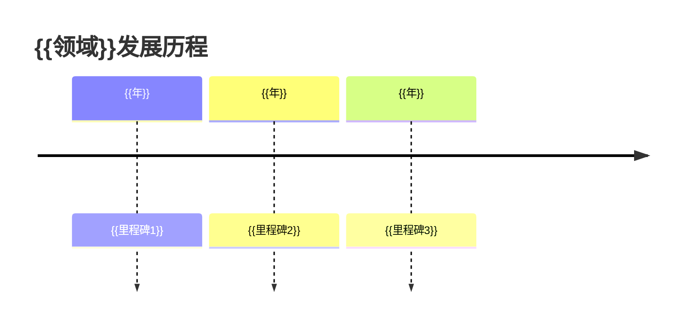
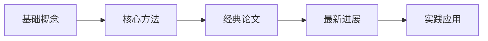

# {{域中文名}} MOC

> [!info] 最后更新
> {{YYYY-MM-DD}} by {{更新者}}

## 领域概述

{{2-3段描述该领域的研究范围、核心问题和发展方向，让外行也能理解}}

### 核心研究问题
1. {{核心问题1}}
2. {{核心问题2}}
3. {{核心问题3}}

### 发展里程碑


---

## 子主题列表

### [[./{{子领域1}}/]] {{子领域1中文名}}
{{简要描述该子领域的研究内容和重要性}}

**核心论文**：
- [[{{论文笔记1}}]] — {{一句话描述}}
- [[{{论文笔记2}}]] — {{一句话描述}}

**关键概念**：
- [[{{概念笔记1}}]]
- [[{{概念笔记2}}]]

### [[./{{子领域2}}/]] {{子领域2中文名}}
{{简要描述该子领域的研究内容和重要性}}

**核心论文**：
- [[{{论文笔记1}}]] — {{一句话描述}}

**关键概念**：
- [[{{概念笔记1}}]]

### [[./{{子领域3}}/]] {{子领域3中文名}}
{{简要描述该子领域的研究内容和重要性}}

**核心论文**：
- [[{{论文笔记1}}]] — {{一句话描述}}

---

## 交叉引用

### 领域内链接
- {{子领域1}} → {{子领域2}}：{{关系描述}}
- {{子领域2}} → {{子领域3}}：{{关系描述}}

### 跨领域链接
- [[../{{其他领域}}/]] → {{领域}}：{{关系描述}}
- {{领域}} → [[../{{其他领域}}/]]：{{关系描述}}

### 相关资源
- [[../Resources/Database-Links.md]] — 数据库链接
- [[../Resources/Tool-Index.md]] — 工具索引

---

## Dataview 查询

### 领域论文列表
```dataview
TABLE title as 标题, year as 年份, paper_type as 类型, methods as 方法
FROM "{{域}}"
WHERE type = "paper"
SORT year DESC
```

### 按方法筛选
```dataview
TABLE title as 标题, year as 年份, tools as 工具
FROM "{{域}}"
WHERE contains(methods, "{{方法}}")
SORT year DESC
```

### 按时间范围筛选
```dataview
TABLE title as 标题, journal as 期刊, read_date as 阅读日期
FROM "{{域}}"
WHERE year >= {{起始年}} AND year <= {{结束年}}
SORT read_date DESC
```

### 高评分论文
```dataview
TABLE title as 标题, year as 年份, rating as 评分
FROM "{{域}}"
WHERE rating >= {{最低评分}}
SORT rating DESC
```

### 近期阅读
```dataview
TABLE title as 标题, read_date as 阅读日期, read_depth as 深度
FROM "{{域}}"
WHERE read_date >= {{YYYY-MM-DD}}
SORT read_date DESC
LIMIT 10
```

### 方法使用频率
```dataview
TABLE method as 方法, count(*) as 使用次数
FROM "{{域}}"
FLATTEN methods as method
WHERE type = "paper"
GROUP BY method
SORT count DESC
```

### 工具使用统计
```dataview
TABLE tool as 工具, count(*) as 使用次数
FROM "{{域}}"
FLATTEN tools as tool
WHERE type = "paper"
GROUP BY tool
SORT count DESC
```

---

## 学习路径

### 入门路径


### 推荐阅读顺序
| 顺序 | 论文/资源 | 目的 |
|------|-----------|------|
| 1 | {{资源1}} | {{目的}} |
| 2 | {{资源2}} | {{目的}} |
| 3 | {{资源3}} | {{目的}} |

### 实践项目
| 项目 | 相关论文 | 难度 |
|------|----------|------|
| {{项目1}} | {{论文}} | ⭐⭐ |
| {{项目2}} | {{论文}} | ⭐⭐⭐ |

---

## 待探索问题

| 问题 | 相关子领域 | 探索价值 |
|------|-----------|----------|
| {{问题1}} | {{子领域}} | {{价值}} |
| {{问题2}} | {{子领域}} | {{价值}} |

---

## 贡献指南

如果你想为本领域 MOC 贡献内容：
1. 在对应子目录添加新的论文笔记
2. 更新本文件的子主题列表
3. 补充 Dataview 查询（如果需要新的查询类型）
4. 更新最后更新时间

---

## 相关链接

- [[../Templates/note-template.md]] — 单论文笔记模板
- [[../Templates/comparison-template.md]] — 对比分析模板
- [[./vault-scaffold.md]] — 知识库目录结构
