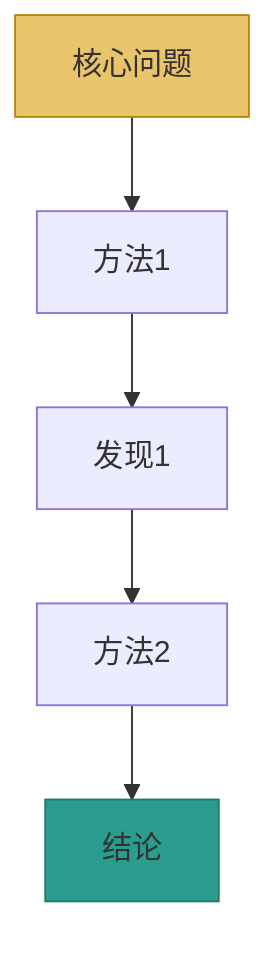

# {{年}}-{{期刊}}-{{关键词}} [[{{原始PDF文件名}}]]

> [!abstract]- Abstract
> {{50字以内中文概括全文核心发现}}

> [!abstract]- 快读路径
> 
> **核心发现**：
> 1. {{发现1一句话}}
> 2. {{发现2一句话}}
> 3. {{发现3一句话}}
> 
> **论证链速览**：
> → 3.1 {{转折点1一句话}} → 3.X {{转折点2一句话}} → 3.N {{转折点N一句话}}
> 
> **阅读建议**：
> - 理解论证逻辑 → Section 3主干叙述
> - 深入看数据 → 每个Panel加粗标签处
> - 复现实验 → Section 4方法学详解
> - 批判审视 → Section 6批判性评价

---

## 1. 研究背景

### 1.1 领域现状

{{2–3段介绍该领域基本状况}}

> [!tip]- Background: 已有方法对比
> | 方法 | 优势 | 局限 | 参考文献 |
> |------|------|------|----------|
> | {{方法A}} | … | … | [[相关笔记]] |

### 1.2 已知范式概览

{{2-3段系统介绍领域在本文发表前的主流认知。当论文核心发现是对已知系统/方法的替代/改进时，重点介绍该已知范式的工作原理、关键组件、适用范围。若无明确对标系统则可精简。}}

### 1.3 核心未解问题

{{明确指出本论文要解决的问题——1–2句话}}

### 1.4 本研究切入点

{{解释作者为什么选择这个角度解决问题}}

---

## 2. 研究策略总览



> **逻辑链：** {{一句话概括整体论证逻辑}}
> **转折点标记：** {{指出哪些3.x是论证链关键转折/双重节点}}

---

## 3. 结果详解

---

### 3.1 {{标题}} ★转折点

**实验目的：** {{1–2句说明本实验要回答什么问题}}

{{主干叙述：展开关键发现前的铺垫，含实验设计背景和对照逻辑。≥8句}}

![[fig1.png|w800]]

*图1 {{整体标题}}。(a) {{Panel A子标题}}；(b) {{Panel B子标题}}；(c) {{Panel C子标题}}；(d) {{Panel D子标题}}。*

**Panel A — {{子标题}}** {{2-3句解读：具体数据、形态、与预期对比}}

**Panel B — {{子标题}}** {{2-3句解读}}

**Panel C — {{子标题}}** {{2-3句解读}}

**Panel D — {{子标题}}** {{2-3句解读}}

**图的整体逻辑：** {{1句概括各Panel间递进关系}}

**核心发现：** {{2-3句总结本实验的关键发现，含具体数据}}

**逻辑衔接：** {{发现→追问→设计（[[4.X Protocol]])→预期→验证，完整5步闭环}}

> 🧪 方法局限：{{一句话+[[4.X Protocol]]链接}}（仅存在时才写）

---

### 3.2 {{标题}} （确认点）

**实验目的：** {{1-2句}}

{{主干叙述：精炼展开发现，4-6句}}

![[fig2.png|w800]]

*图2 {{整体标题}}。(a) {{核心Panel子标题}}；(b) {{子标题}}。*

**Panel A — {{核心Panel子标题}}** {{2-3句解读}}

**Panel B — {{子标题}}** {{1-2句解读（确认点可精炼）}}

**核心发现：** {{1-2句总结}}

**逻辑衔接：** {{追问→设计→验证，简洁3步}}

> 🧪 方法局限：{{一句话+[[4.X Protocol]]链接}}（仅存在时才写）

---

### 3.3 {{标题}} ★双重节点

**实验目的：** {{1-2句}}

{{主干叙述：既确认前结论又揭示新方向，≥8句}}

![[fig3.png|w800]]

*图3 {{整体标题}}。(a)...(b)...*

**Panel A — {{子标题}}** {{2-3句解读}}

**图的整体逻辑：** {{1句}}

**核心发现：** {{2-3句，明确标注"确认XX+揭示YY"}}

**逻辑衔接：** {{确认前结论→追问新方向→设计→预期1（如果YY成立）+预期2（如果YY不成立）→验证，5步闭环+双预期}}

> 🧪 方法局限：{{一句话+[[4.X Protocol]]链接}}（仅存在时才写）

---

### 3.N {{最后一个实验}}

{{根据转折/确认/双重选择详写或精写}}

> [!critique]- 方法论硬伤（仅真正硬伤才有）
> {{描述硬伤+影响范围}}

**论证闭环：** 至此，论证链完成从{{起点}}到{{终点}}的全过程验证。

---

## 4. 方法学详解

> [!tip]- Reproducibility Note
> 以下参数和步骤均来自原文，部分参数作者未明确说明选择理由（已标注"未说明"）。

### 4.1 {{方法名}}

**目的：** {{一句话说明该方法要解决什么问题}}

| 参数 | 值 | 说明 |
|------|-----|------|
| {{参数1}} | {{值}} | {{为什么选这个值}} |

**关键对照：**

| 对照组 | 目的 | 预期结果 |
|--------|------|----------|
| {{对照组1}} | {{…}} | {{…}} |

> [!tip]- Protocol: {{方法名}}
> | 项目 | 内容 |
> |------|------|
> | **原理** | {{该方法背后的基本原理}} |
> | **关键对照** | {{必须设置什么对照}} |
> | **常见问题** | {{初学者容易踩的坑}} |

> [!tip]- Code
> ```bash
> tool-name --param1 value1 input.file -o output.file
> # --param1: {{含义}}（默认值：{{default}}）
> ```

---

## 5. Discussion 解读

### 5.1 作者核心论点

{{作者在讨论中提出的主要论证逻辑，2–3句概括}}

### 5.2 作者自述局限

- {{作者自己承认的研究局限1}}
- {{作者自己承认的研究局限2}}

### 5.3 作者观点 vs 批判对照

| 议题 | 作者立场 | 批判立场 | 关系 |
|------|----------|----------|------|
| {{议题1}} | {{作者认为…}} | {{批判认为…}} | 延伸 / 补充 / 矛盾 |
| {{议题2}} | {{…}} | {{…}} | {{…}} |

---

## 6. 批判性综合评价

### 6.1 批判索引

> 以下批判已嵌入式分布于各结果小节（🧪引用块和[!critique]-），此处为汇总索引。

| 实验 | 锚点 | 批判形式 | 核心批判 |
|------|------|----------|---------|
| 3.1 | [[#3.1 {{标题}}]] | 🧪引用块 | {{1句话概括}} |
| 3.X | [[#3.X {{标题}}]] | [!critique]- | {{1句话概括（仅硬伤）}} |

---

### 6.2 假设判决

> [!critique]- Hypothesis Verdict
> **假设：** {{假设陈述}}
>
> **判决：** `支持` / `部分支持` / `拒绝`
>
> | 铁证 | 来源 | 数据 |
> |------|------|------|
> | 铁证1 | {{Figure/Table编号}} | {{具体数值/效应量}} |
> | 铁证2 | {{Figure/Table编号}} | {{具体数值}} |
> | 铁证3 | {{Figure/Table编号}} | {{具体数值}} |
>
> **理由：** {{1–2句解释为什么这个判决成立}}

---

### 6.3 攻击清单

> [!critique]- Attack List（仅真正方法论硬伤）
> **漏洞1** | 严重程度：`critical`
> - **描述：** {{最严重方法论漏洞}}
> - **外部视角：** {{从哪个理论/方法视角攻击}}
> - **证据：** {{论文中暴露此漏洞的数据/方法细节}}

---

### 6.4 边界条件

> [!critique]- Boundary Conditions
> | 条件类型 | 描述 |
> |----------|------|
> | **保质期** | {{在XX条件下本发现成立}} |
> | **失效区** | {{在XX条件下本发现可能失效}} |
> | **强条件** | {{必须满足的条件}} |
> | **弱条件** | {{最好满足但不强制}} |

---

### 6.5 范式贡献

> [!critique]- Core Contribution
> **So What?** {{一句话范式级贡献——改变了看待该主题的方式}}
>
> **级别：** `范式转移` / `显著增量` / `微小增量`

---

### 6.6 研究裂变

> [!question]- Research Fission
> **问题1：** {{从漏洞武器化的可操作新研究问题}}
> - **重要性：** {{解决此问题可填补什么缺口}}
> - **实验设计：** {{具体实验/分析方法设计}}
> - **预期结果：** {{如果假设成立会看到什么}}
>
> **问题2：** {{从边界条件武器化}}
> - **重要性：** {{…}}
> - **实验设计：** {{…}}
> - **预期结果：** {{…}}
>
> **问题3：** {{从双重节点/范式转移武器化}}
> - **重要性：** {{…}}
> - **实验设计：** {{…}}
> - **预期结果：** {{…}}

---

## 7. 核心结论

> [!abstract]- Key Findings
> 1. {{发现1一句话}}
> 2. {{发现2一句话}}
> 3. {{发现3一句话}}

---

## 8. 关键数据速查

| 实验 | 关键数据 | 结论 |
|------|---------|------|
| {{实验1}} | {{数据}} | {{结论}} |
| {{实验2}} | {{数据}} | {{结论}} |
| {{实验3}} | {{数据}} | {{结论}} |

---

## 9. 相关文献

- [[{{相关笔记1}}]] — {{关系描述}}
- [[{{相关笔记2}}]] — {{关系描述}}