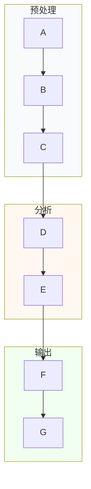

# Obsidian 格式完整参考

本文件是论文解读技能所有Obsidian输出格式的权威参考。确保所有生成的笔记格式一致、兼容Dataview查询、在Obsidian中正确渲染。

---

## 一、YAML Frontmatter Schema

### 1.1 必填字段

| 字段 | 类型 | 格式 | 示例 | 说明 |
|------|------|------|------|------|
| title | string | 英文原标题 | "Deep learning for protein structure prediction" | 不翻译标题 |
| year | integer | 4位数字 | 2024 | 发表年份 |
| journal | string | 标准缩写 | "Nature" | 按config.json缩写表 |
| paper_type | string(enum) | 固定6选1 | "computational" | methodological/discovery/review/database/computational/structural |
| domains | list[string] | 固定域标签 | [bioinformatics, biology] | bioinformatics/biology/ai-ml/structural-biology |
| read_date | date | YYYY-MM-DD | 2024-12-15 | 解读日期 |
| tags | list[string] | #category/sub | [type/computational, domain/bioinformatics] | 层级标签 |

### 1.2 可选字段

| 字段 | 类型 | 格式 | 示例 |
|------|------|------|------|
| authors | list[string] | 姓, 名 | [Smith, John, Zhang, Wei] |
| corresponding_author | string | 姓名 | "John Smith" |
| affiliation | string | 单位 | "MIT" |
| doi | string | DOI | "10.1038/s41586-024-12345" |
| pubmed_id | string | PMID | "38123456" |
| arxiv_id | string | arXiv ID | "2401.12345" |
| keywords | list[string] | 关键词 | [CRISPR, gene editing] |
| methods | list[string] | 方法 | [scRNA-seq, DESeq2, UMAP] |
| tools | list[string] | 工具 | [Seurat, CellRanger, STAR] |
| databases | list[string] | 数据库 | [GEO, SRA, PDB] |
| read_depth | string(enum) | overview/reproduction | "reproduction" |
| note_version | integer | 版本号 | 1 |
| aliases | list[string] | 别名 | [简称, 中文标题] |
| source_pdf | string | 原始PDF绝对路径 | "A:/papers/nature12345.pdf" |

### 1.3 Dataview 兼容性规则

- 所有列表字段使用 YAML 数组语法: `[item1, item2]`
- 日期字段使用 ISO 格式: `2024-12-15`
- 标签字段包含 `#` 前缀: `[type/computational]`
- 数值字段使用整数/浮点数: `year: 2024`（非字符串）
- 避免在YAML值中使用冒号、引号等特殊字符

### 1.4 完整示例

```yaml
---
title: "AlphaFold3: Accurate structure prediction for diverse biomolecular complexes"
year: 2024
journal: "Nature"
authors: [Abramson, Josh, Adler, Jonas, Dunger, Jack]
corresponding_author: "John Jumper"
affiliation: "Google DeepMind"
doi: "10.1038/s41586-024-07487-w"
pubmed_id: "38703567"
keywords: [protein structure, deep learning, AlphaFold, molecular complex]
paper_type: "computational"
domains: [bioinformatics, ai-ml, structural-biology]
methods: [diffusion model, attention mechanism, multiple sequence alignment]
tools: [AlphaFold3, HHblits, JackHMMER]
databases: [PDB, UniProt, BFD]
read_date: 2024-12-15
read_depth: "reproduction"
note_version: 1
tags:
  - type/computational
  - domain/bioinformatics
  - domain/ai-ml
  - domain/structural-biology
  - method/attention-mechanism
  - method/diffusion-model
  - tool/AlphaFold3
  - year/2024
aliases: [AF3, AlphaFold 3]
---
```

---

## 二、Wikilink 约定

### 2.1 何时创建 Wikilink

| 创建条件 | 示例 | 目标笔记 |
|----------|------|----------|
| 术语出现≥2次 | `[[差异表达基因(DEG)]]` | 概念笔记 |
| 具名方法 | `[[DESeq2]]` | 方法笔记 |
| 工具名称 | `[[Seurat]]` | 工具笔记 |
| 数据库名称 | `[[GEO数据库]]` | 资源笔记 |
| 基因/蛋白质 | `[[TP53]]` | 基因笔记 |
| 其他论文 | `[[2024-Nature-AlphaFold3]]` | 论文笔记 |

### 2.2 不创建 Wikilink 的情况

- 只出现1次的术语（除非特别重要）
- 通用词汇（细胞、基因、蛋白质等）
- 无需独立笔记的修饰词
- 论文中临时定义的缩写

### 2.3 格式规则

- **标准格式**: `[[目标笔记标题]]`
- **显示文本不同**: `[[目标笔记标题|显示文本]]`
  - 示例: `[[DESeq2|DESeq2差异分析]]`
- **消歧义**: 在目标笔记标题后加上下文
  - 示例: `[[alignment-BWA|BWA]]` vs `[[alignment-Bowtie2|Bowtie2]]`
- **嵌套引用**: 在Callout块内正常使用 `[[wikilink]]`

### 2.4 原文PDF链接

每篇笔记**必须**包含原文PDF的链接，方便读者直接在Obsidian中打开原文：

1. **YAML frontmatter**: 添加 `source_pdf` 字段记录原始PDF绝对路径
2. **标题行wikilink**: 在笔记标题后添加PDF文件的wikilink，如 `# 2024-Nature-AlphaFold3[[original-paper.pdf]]`
3. **PDF复制**: 在Phase 6中，将原始PDF复制到笔记同目录，确保wikilink可被Obsidian解析

```yaml
# YAML示例
source_pdf: "A:/papers/nature12345.pdf"
```

```markdown
# 标题行示例
# 2024-Nature-AlphaFold3[[nature12345.pdf]]
```

**为什么**：Obsidian的wikilink可以链接任何文件类型，包括PDF。将PDF放在同目录下，点击标题行的链接即可直接在Obsidian中预览或打开原文。

---

## 2.5 图像引用规则

图像引用**必须包含文件扩展名**（如 `.png`），否则Obsidian可能无法正确解析。图像**不可孤立堆放**，必须在叙述逻辑节点处嵌入并解读。

| 格式 | 是否正确 | 说明 |
|------|----------|------|
| `![[fig1-overview.png\|w800]]` | ✅ 正确 | 包含扩展名+宽度控制 |
| `![[fig1-overview\|w800]]` | ❌ 错误 | 缺少扩展名，Obsidian可能无法定位文件 |
| `![[fig1-overview.png]]` | ✅ 正确 | 包含扩展名，原始大小 |
| `![[table1-params.png\|w600]]` | ✅ 正确 | 表格裁剪图，指定宽度 |

**规则**：
- 所有提取的图像统一使用 `.png` 格式
- 引用时始终写完整文件名（含扩展名）
- 宽度控制使用 `|w800`（Figure）或 `|w600`（Table/Formula）
- **每张图必须配有 `[!figure]-` 解读Callout，7个必含字段**
- **图必须在叙述逻辑节点处嵌入，遵循"前导句→图→解读→后续叙述"四步节奏**
- **禁止**在"图像"独立小节下集中堆放所有图

---

## 三、标签体系

### 3.1 层级结构

```
#type/
  #type/methodological      方法学论文
  #type/discovery           发现型论文
  #type/review              综述论文
  #type/database            数据库/资源论文
  #type/computational       计算/生信论文
  #type/structural          结构生物学论文
  #type/comparison          对比分析笔记

#domain/
  #domain/bioinformatics    生物信息学
  #domain/biology           生物学
  #domain/ai-ml             人工智能/机器学习
  #domain/structural-biology 结构生物学

#method/
  #method/scRNA-seq         单细胞RNA测序
  #method/WGS               全基因组测序
  #method/RNA-seq           RNA测序
  #method/ChIP-seq          ChIP测序
  #method/CRISPR            CRISPR基因编辑
  #method/transformer       Transformer架构
  #method/GNN               图神经网络
  #method/diffusion-model   扩散模型

#tool/
  #tool/Seurat              Seurat单细胞分析
  #tool/CellRanger          CellRanger处理
  #tool/STAR                STAR比对
  #tool/DESeq2              DESeq2差异分析
  #tool/PyTorch             PyTorch框架
  #tool/AlphaFold           AlphaFold系列

#database/
  #database/GEO             GEO表达数据库
  #database/SRA             SRA序列库
  #database/PDB             PDB结构库
  #database/UniProt         UniProt蛋白库

#year/
  #year/2024                2024年
  #year/2025                2025年
```

### 3.2 标签 vs YAML 属性

| 用途 | 标签 | YAML属性 |
|------|------|----------|
| 宽泛分类 | ✓ `#type/computational` | — |
| 精确查询 | — | ✓ `tools: [Seurat, STAR]` |
| Dataview过滤 | ✓ `FROM #method/scRNA-seq` | ✓ `WHERE contains(tools, "Seurat")` |
| 自动补全 | ✓ Obsidian原生 | — |
| 批量修改 | 需要正则 | 直接编辑YAML |

### 3.3 标签使用规则

- 每篇笔记至少包含: 1个 `#type/`、1个 `#domain/`、1个 `#year/`
- 方法/工具/数据库标签按论文实际使用添加
- 标签名统一用英文小写，单词间用 `-` 连接
- 不要创建不在上述体系中的标签（如需扩展先更新本文件）

---

## 四、Callout 块

### 4.1 七种类型

#### [!abstract] 一句话概括
- **位置**: 笔记最顶部，紧跟标题后
- **内容**: 50字以内的中文概括
- **折叠**: 始终折叠（`-`）
- **每篇笔记1个**

```markdown
> [!abstract] 一句话概括
> 研究者开发了一种基于深度学习的方法，能够从氨基酸序列准确预测蛋白质复合物三维结构。
```

#### [!figure] 图解读
- **位置**: 每张图片嵌入后紧跟
- **内容**: 7个必含字段的图解读（目的/坐标轴/趋势/统计/对照/异常/支撑结论）
- **折叠**: 默认折叠（`-`）
- **每张图1个**

```markdown
> [!figure]- 图N解读
> **图的目的**：这张图要回答什么问题，在论证链中扮演什么角色
> **坐标轴/分区**：X轴、Y轴含义，各panel展示内容
> **关键趋势**：主要数据趋势方向和转折点
> **统计显著性**：p值、效应量、置信区间
> **对照组差异**：与对照组/基准方法的差异有多大
> **异常点**：偏离趋势的数据点或边界情况
> **支撑结论**：图中哪个特征支撑论文哪个结论
```

**使用规则**：
- 每张图必须配有 `[!figure]-` 解读块，不可跳过
- 图不可孤立堆放，必须在叙述逻辑节点处嵌入
- 遵循"前导句→图→解读→后续叙述"四步节奏
- 不同图类型解读重点不同（见SKILL.md Phase 4图文融合规则）

---

#### [!info] 进阶概念
- **位置**: 相关章节内
- **内容**: 超出初学者水平的高级分析、背景知识
- **折叠**: 默认折叠（`-`）
- **多篇笔记可多个**

```markdown
> [!info]- 进阶概念：Transformer中的位置编码(Positional Encoding)
> Transformer本身不具备位置感知能力，需要通过位置编码注入序列顺序信息。常用的有：
> - **正弦位置编码**: PE(pos,2i) = sin(pos/10000^(2i/d))
> - **可学习位置编码**: 随模型训练优化
> - **旋转位置编码(RoPE)**: Alibi等相对位置编码方案
```

#### [!tip] 实践要点
- **位置**: 方法/结果章节内
- **内容**: 可操作的建议、操作要点、参数选择指导
- **折叠**: 默认折叠（`-`）**

```markdown
> [!tip]- 实践要点：DESeq2差异表达分析
> - **原理**：基于负二项分布建模计数数据
> - **选择理由**：RNA-seq计数数据不满足正态分布，需使用专门的统计模型
> - **关键对照**：必须有生物学重复(≥3)，否则离散度估计不可靠
> - **参数建议**：使用默认参数即可，不要随意修改fitType
```

#### [!warning] 常见误区
- **位置**: 方法/操作步骤章节内
- **内容**: 初学者常犯的错误及规避方法
- **折叠**: 默认折叠（`-`）**

```markdown
> [!warning]- 常见误区：UMAP/t-SNE解读
> - ❌ 从图上定量比较簇间距离（距离不保真）
> - ❌ 认为聚类大小反映真实细胞比例（会被压缩/膨胀）
> - ✅ 用多种参数运行验证结果稳定性
> - ✅ 仅将可视化结果作为辅助，用统计检验验证
```

#### [!example] 代码复现
- **位置**: 方法学详解章节
- **内容**: 完整命令行/代码，可直接复制运行
- **折叠**: 默认折叠（`-`）**

```markdown
> [!example]- 代码复现：Seurat v5 单细胞分析
> ```R
> library(Seurat)
> # 创建Seurat对象
> obj <- CreateSeuratObject(counts = data, min.features = 200)
> # 质控过滤
> obj <- subset(obj, subset = nFeature_RNA > 200 & nFeature_RNA < 5000 &
>                      percent.mt < 20)
> # 标准化
> obj <- NormalizeData(obj, normalization.method = "LogNormalize", scale.factor = 10000)
> ```
```

#### [!question] 思考题
- **位置**: 结论/延伸章节
- **内容**: 延伸思考问题，附"为什么重要"和"如何研究"
- **折叠**: 默认折叠（`-`）**

```markdown
> [!question]- 思考题：该方法的泛化性如何？
> **为什么重要**：仅在同一类型数据上验证的方法可能存在领域偏倚
> **如何研究**：
> 1. 在3个以上不同组织/物种的数据集上重复实验
> 2. 使用留一物种交叉验证(leave-one-species-out)
> 3. 与领域特定方法对比，评估通用性vs特异性的权衡
```

### 4.2 Callout 嵌套规则

- Callout块内部可使用表格、列表、代码块
- 内部行统一以 `> ` 开头
- 代码块内行以 `> ``` ` 包裹
- 不支持Callout嵌套（Obsidian限制）

---

## 五、Dataview 查询

### 5.1 常用查询示例

```dataview
TABLE title, year, journal
FROM "01-Bioinformatics"
SORT year DESC
```

```dataview
TABLE title, year, journal
FROM #method/scRNA-seq
SORT year DESC
```

```dataview
TABLE title, read_date
WHERE read_date >= date(today) - dur(30 days)
SORT read_date DESC
```

```dataview
TABLE title, year
WHERE contains(tools, [[Seurat]])
SORT year DESC
```

```dataview
TABLE title, year, journal
FROM #type/review
SORT year DESC
```

```dataview
LIST
FROM #domain/bioinformatics AND #year/2024
```

### 5.2 统计查询

```dataview
TABLE length(rows) as "论文数"
FROM "01-Bioinformatics" OR "01-Biology" OR "02-AI-ML"
GROUP BY choice(contains(file.path, "Bioinformatics"), "生物信息学",
         choice(contains(file.path, "Biology"), "生物学", "AI/ML"))
```

---

## 六、Mermaid 图规范

### 6.1 图类型

| 用途 | 图类型 | 布局 | 说明 |
|------|--------|------|------|
| 分析流水线 | flowchart | LR | 从左到右的数据流 |
| 模型架构 | graph | TD | 从上到下的层次结构 |
| 概念关系图 | graph | TD | 概念间关联 |
| 实体关系 | graph | LR | 工具/数据库关系 |
| 时间线 | timeline | - | 方法/工具演进 |

### 6.2 节点样式约定

| 节点类型 | 形状 | 颜色 | 示例 |
|----------|------|------|------|
| 输入/输出 | 方括号 | 金色#E9C46A(输入)/青绿#2A9D8F(输出) | `A[Raw Data]` |
| 处理步骤 | 方括号 | 橙色#F4A261 | `B[Alignment]` |
| 决策点 | 菱形 | 红色#E76F51 | `C{QC Pass?}` |
| 数据存储 | 圆柱 | 蓝色#5E81AC | `D[(Database)]` |
| 辅助/可选 | 方括号 | 灰色#D6E4F0 | `E[Optional Step]` |

### 6.3 边样式约定

| 关系类型 | 线型 | 说明 |
|----------|------|------|
| 主数据流 | `-->` 实线 | 核心流程 |
| 残差/跳跃连接 | `-.->` 虚线 | 旁路连接 |
| 条件分支 | `-->\|条件\|` 带标签 | 条件性步骤 |
| 反馈/循环 | `-->` 带标签 | 反馈回路 |

### 6.4 大图处理

当节点数 > 15 时：
1. 使用 `subgraph` 将相关节点分组
2. 每个subgraph有语义化名称和浅色背景
3. subgraph间用颜色区分


