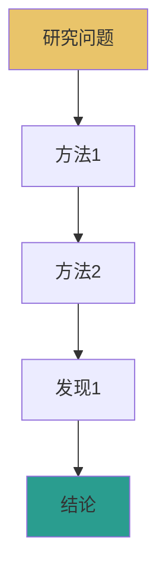
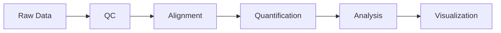
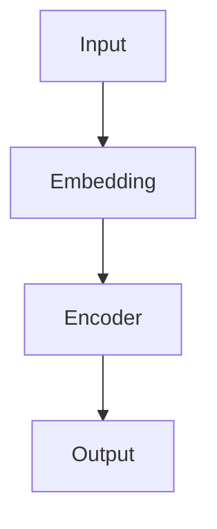
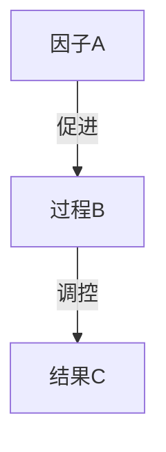

# {{年}}-{{期刊}}-{{关键词}}[[{{原始PDF文件名}}]]

> [!abstract] 一句话概括
> {{50字以内中文概括全文核心发现}}

---

## 一、研究背景

### 1.1 领域现状
{{2-3段介绍该领域基本状况，让外行也能理解}}

{{若论文含领域概览图，在此处嵌入：前导句→图→[!figure]-解读}}

![[{{fig1-pathway-overview}}.png|w800]]

> [!figure]- 图1解读
> **图的目的**：{{展示领域核心通路/框架/分类体系}}
> **分区**：{{各区域展示什么内容}}
> **关键节点**：{{图中最重要的节点/路径/类别}}
> **与本研究的关联**：{{本研究聚焦于图中哪个区域/节点}}

### 1.2 核心未解问题
{{明确指出本论文要解决的问题}}

> [!info]- 进阶：已有方法对比
> | 方法 | 优势 | 局限 | 参考文献 |
> |------|------|------|----------|
> | {{方法A}} | ... | ... | [[相关笔记]] |

### 1.3 本研究切入点
{{解释作者为什么选择这个角度解决问题}}

---

## 二、研究策略总览



---

## 三、结果详解

### 3.N 结果N：{{标题}}

**方法**：
- 实验设计逻辑：{{为什么这么做}}
- 关键试剂/设备：{{具体型号和来源}}
- 操作步骤：{{足够复现的细节}}
- 数据分析方法：{{用了什么统计/计算方法}}

**关键发现**：

{{叙述段落：描述实验目的和预期，1-2句话}}

{{前导句：预告接下来的图将展示什么关键数据}}

![[{{figN-description}}.png|w800]]

> [!figure]- 图N解读
> **图的目的**：{{这张图要回答什么问题，在论证链中扮演什么角色}}
> **坐标轴/分区**：{{X轴、Y轴含义，各panel展示内容}}
> **关键趋势**：{{主要数据趋势方向和转折点}}
> **统计显著性**：{{p值、效应量、置信区间（原文标注的必须提取）}}
> **对照组差异**：{{与对照组/基准方法的差异有多大}}
> **异常点**：{{偏离趋势的数据点或边界情况}}
> **支撑结论**：{{图中哪个特征支撑论文哪个结论}}

{{后续叙述：基于图的数据继续推进论述，衔接下一个发现}}

| 指标 | 结果 | 对照 | 显著性 |
|------|------|------|--------|
| {{指标1}} | {{值}} | {{对照值}} | {{p值}} |

> [!tip]- 实践要点：{{方法名}}原理
> - **原理**：{{该方法背后的基本原理}}
> - **选择理由**：{{为什么用这个方法而不是其他}}
> - **关键对照**：{{必须设置什么对照及原因}}

> [!warning]- 常见误区
> - {{初学者容易犯的错误1}}
> - {{初学者容易犯的错误2}}

> [!example]- 代码复现
> ```bash
> # {{工具名}} {{版本}} - {{操作描述}}
> tool-name --param1 value1 --param2 value2 input.file -o output.file
> # 参数说明：
> # --param1: {{含义}}（默认值：{{default}}）
> # --param2: {{含义}}
> ```

---

## 四、方法学详解

### 4.N 方法N：{{名称}}

**目的**：{{一句话说明该方法要解决什么问题}}

**完整操作步骤**：
| 步骤 | 操作 | 参数 | 理由 |
|------|------|------|------|
| 1 | {{操作1}} | {{参数}} | {{为什么这么做}} |

**参数解读表**：
| 参数 | 值 | 为什么选这个值 | 调参建议 |
|------|----|--------------|----------|

**关键对照**：
| 对照组 | 目的 | 预期结果 |
|--------|------|----------|

**常见问题与解决**：
| 问题 | 可能原因 | 解决方案 |
|------|----------|----------|

> [!question]- 思考题
> 1. {{问题1}}
> 2. {{问题2}}

---

## 五、生信/AI专用部分

### 5.1 分析流水线（生信论文）


### 5.2 数据库资源汇总
| 数据库 | ID | 数据类型 | 访问方式 | 备注 |
|--------|-----|----------|----------|------|

### 5.3 统计方法解读
| 方法 | 原理 | 适用场景 | 结果解读 | 注意事项 |
|------|------|----------|----------|----------|

### 5.4 模型架构（AI/ML论文）


**超参数表**：
| 超参数 | 值 | 含义 | 调参建议 |
|--------|----|------|----------|

---

## 六、核心结论

### 6.1 主要发现
1. {{发现1一句话}}
2. {{发现2一句话}}
3. {{发现3一句话}}

### 6.2 科学意义模型
基于上述所有发现，本研究提出的调控机制模型如下：

![[{{figN-mechanism-model}}.png|w800]]

> [!figure]- 图N解读
> **图的目的**：{{整合所有数据，提出完整机制模型}}
> **模型核心**：{{模型的核心因果链：A→B→C}}
> **证据链**：{{哪几个Figure分别验证了模型中的哪些环节}}
> **开放问题**：{{虚线标注的未验证环节}}



### 6.3 与已有工作比较
| 维度 | 本研究 | {{方法A}} | {{方法B}} |
|------|--------|-----------|-----------|
| {{维度1}} | ... | ... | ... |

### 6.4 应用前景
- {{具体应用方向1，避免空泛}}
- {{具体应用方向2}}

> [!info]- 进阶：局限性与未解问题
> - 局限1：{{描述}}
> - 局限2：{{描述}}

---

## 七、实验技术总结

| 技术 | 用途 | 关键试剂/设备 | 关键参数 | 复现难度 |
|------|------|---------------|----------|----------|

---

## 八、关键思考与延伸

> [!question]- 思考题1：{{问题}}
> **为什么重要**：{{理由}}
> **如何研究**：{{具体实验设计建议}}

> [!question]- 思考题2：{{问题}}
> **为什么重要**：{{理由}}
> **如何研究**：{{具体实验设计建议}}

---

## 九、数据与代码可用性

| 类型 | 来源 | 链接/ID |
|------|------|---------|
| 原始数据 | {{数据库}} | {{ID}} |
| 处理数据 | {{来源}} | {{链接}} |
| 代码 | {{仓库}} | {{URL}} |
| 补充材料 | {{来源}} | {{链接}} |

---

## 十、相关文献

- [[{{相关论文笔记1}}]] — {{关系描述}}
- [[{{相关论文笔记2}}]] — {{关系描述}}
